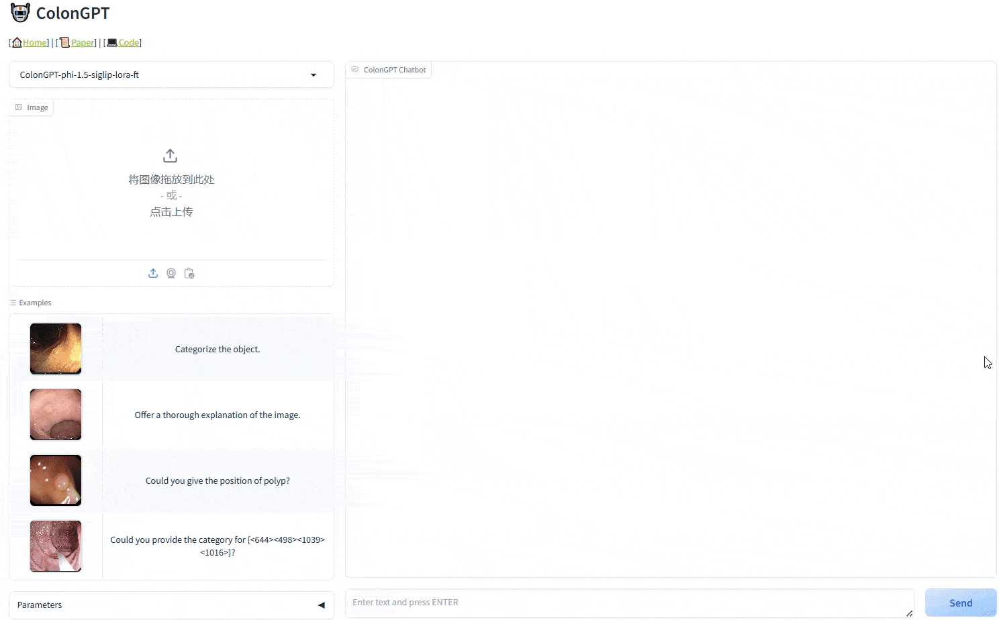
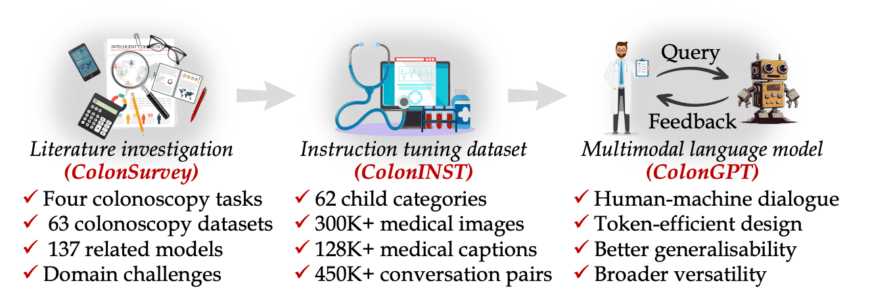
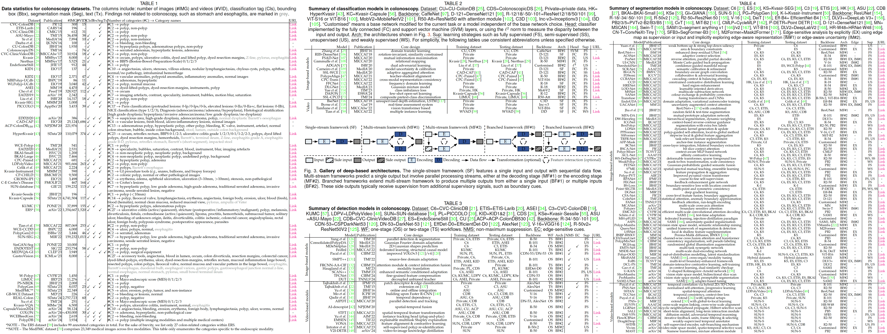
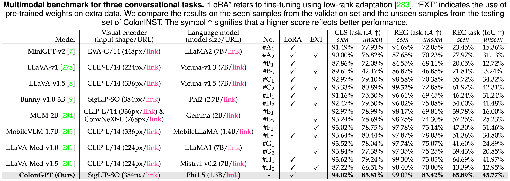

<p align="center">
     <br />
</p>

<div align="center">
    <p align="center">
        🔬 <b>Paper</b> (🔗 <a href="https://arxiv.org/abs/2410.17241">arXiv</a>, 🤗 <a href="https://huggingface.co/papers/2410.17241">Huggingface</a>, 🤖 <a href="https://www.aimodels.fyi/papers/arxiv/frontiers-intelligent-colonoscopy">AIModels.fyi</a>  | 
        📖 <b>ColonSurvey</b> (🔗 <a href="https://docs.google.com/spreadsheets/d/1V_s99Jv9syzM6FPQAJVQqOFm5aqclmrYzNElY6BI18I/edit?usp=sharing">Online Sheet</a>) |
        🏥 <b>ColonINST</b> (🔗 <a href="https://drive.google.com/drive/folders/1ng2DQav-Gfts6hIr3_vCUC-a2gCWzzCO?usp=sharing">Google Drive</a>, 🤗 <a href="https://huggingface.co/datasets/ai4colonoscopy/ColonINST-v1">Huggingface</a>) | 
        🤖 <b>ColonGPT</b> (🔗 <a href="https://drive.google.com/file/d/1WL0OIPiwiLeApoK8xaMZ1HR30ZrDtoMk/view?usp=sharing">Google Drive</a>, 🤗 <a href="https://huggingface.co/ai4colonoscopy/ColonGPT-v1">Huggingface</a>) |
        🏇 <b>Multimodal benchmark</b> (🔗 <a href="https://drive.google.com/drive/folders/1q3awr-aT50tuhW9Z01C3LKkckfG4Bk70?usp=sharing">Google Drive</a>, 🔗 <a href="https://paperswithcode.com/dataset/coloninst-v1">PaperWithCode</a>)
    </p>
    <p align="center">
        <i>Keyworks: Intelligent Colonoscopy, Multimodal Colonoscopy Dataset, Multimodal Language Model, Vision-language Understanding, Endoscopic Image Analysis, Healthcare AI, Abdomen.</i>
    </p>
</div>


----


Colonoscopy is currently one of the most sensitive screening methods for colorectal cancer (🔗 [Wikipedia](https://en.wikipedia.org/wiki/Colorectal_cancer)). Have you ever wondered how to make colonoscopy smarter? Well, buckle up, let's enter the exciting world of intelligent colonoscopy!

- **Our vision.** To explore the frontiers of intelligent colonoscopy techniques and their potential impact on multimodal medical applications.
- **Why use IntelliScope?** It combines "**Intelli**gent" and "colono**Scope**", where "Intelli" reflects the intelligent processing and decision-making capabilities of the system, and "Scope" refers to the colonoscope device used in medical endoscopy. Together, they imply a cutting-edge multimodal system designed to improve colonoscopy with advanced AI technologies.
- **Project members.** [Ge-Peng Ji](https://scholar.google.com/citations?hl=en&authuser=1&user=oaxKYKUAAAAJ) (🇦🇺 ANU), Jingyi Liu (🇯🇵 Keio), [Peng Xu](https://scholar.google.com/citations?user=9_v4tC0AAAAJ&hl=en) (🇨🇳 THU), [Nick Barnes](https://scholar.google.com/citations?hl=en&user=yMXs1WcAAAAJ) (🇦🇺 ANU), [Fahad Shahbaz Khan](https://scholar.google.com/citations?user=zvaeYnUAAAAJ&hl=en&authuser=1) (🇦🇪 MBZUAI), [Salman Khan](https://scholar.google.com/citations?user=M59O9lkAAAAJ&hl=en&authuser=1) (🇦🇪 MBZUAI), [Deng-Ping Fan](https://scholar.google.com/citations?user=kakwJ5QAAAAJ&hl=en) (🇨🇳 NKU)
- **Let's join our IntelliScope community.** We are building a discussion forum for the convenience of researchers to 💬 [ask any questions](https://github.com/orgs/ai4colonoscopy/discussions/categories/any-q-a), 💬 [showcase/promote your work](https://github.com/orgs/ai4colonoscopy/discussions/categories/show-tell), 💬 [access data resources](https://github.com/orgs/ai4colonoscopy/discussions/categories/data-helpdesk), and 💬 [share research ideas](https://github.com/orgs/ai4colonoscopy/discussions/categories/ideas-collaborations). 
- **Quick view.** Next, we present some features of our colonoscopy-specific AI chatbot, ColonGPT. This is a domain-pioneering multimodal language model that can help endoscopists perform various user-driven tasks through interactive dialogues.
   <p align="center">
       <br />
   </p>

## Updates

- *[Nov/20/2024]* We are working to a series of colonoscopy-specific multimodal chatbots with different lightweight LLM-brains. Watch our project and stay tuned!
- *[Oct/30/2024]* We've set up an online benchmark on the [paper-with-code](https://paperswithcode.com/dataset/coloninst-v1) website.
- *[Oct/16/2024]* Open-source the whole codebase of project.
## 🔥 Research Highlights

<p align="center">
     <br/>
    <em> 
    Figure 1: Introductary diagram.
    </em>
</p>

- <u>Survey on colonoscopic scene perception (CSP)</u> ➡️ ***"We assess the current landscape to sort out domain challenges and under-researched areas in the AI era."***
   - 📖 **ColonSurvey.** We investigate the latest research progress in four colonoscopic scene perception tasks from both data-centric and model-centric perspectives. Our investigation summarises key features of 63 datasets and 137 representative deep techniques published since 2015. In addition, we highlight emerging trends and opportunities for future study. (🔗 [Hyperlink](https://github.com/ai4colonoscopy/IntelliScope?tab=readme-ov-file#-colonsurvey)) 
- 💥 <u>Multimodal AI Initiatives</u> ➡️ ***"We advocate three initiatives to embrace the coming multimodal era in colonoscopy."***
   - 🏥 **ColonINST.** We introduce a pioneering instruction tuning dataset for multimodal colonoscopy research, aimed at instructing models to execute user-driven tasks interactively. This dataset comprises of 62 categories, 300K+ colonoscopic images, 128K+ medical captions ([GPT-4V)](https://openai.com/index/gpt-4v-system-card/) generated), and 450K+ human-machine dialogues. (🔗 [Hyperlink](https://github.com/ai4colonoscopy/IntelliScope?tab=readme-ov-file#-coloninst-a-multimodal-instruction-tuning-dataset))
   - 🤖 **ColonGPT.** We develop a domain-specific multimodal language model to assist endoscopists through interactive dialogues. To ensure reproducibility for average community users, we implement ColonGPT in a resource-friendly way, including three core designs: a 0.4B-parameter visual encoder 🤗 [SigLIP-SO](https://huggingface.co/google/siglip-so400m-patch14-384) from Google, a 1.3B-parameter lightweight language model 🤗 [Phi1.5](https://huggingface.co/microsoft/phi-1_5) from Microsoft, and a multigranularity adapter for token reducing *from 100% to only 33.74% but not compromise to performance*. (🔗 [Hyperlink](https://github.com/ai4colonoscopy/IntelliScope?tab=readme-ov-file#-colongpt-a-colonoscopy-specific-multimodal-language-model))
   - 💯 **Multimodal Benchmark.** We contribute a multimodal benchmark, including six general-purpose models and two designed for medical purposes, across three colonoscopy tasks to enable fair and rapid comparisons going forward. (🔗 [Hyperlink](https://github.com/ai4colonoscopy/IntelliScope?tab=readme-ov-file#-multimodal-benchmark))


## 📖 ColonSurvey 

Our *"ColonSurvey"* project contributes various useful resources for the community. We investigate 63 colonoscopy datasets and 137 deep learning models focused on colonoscopic scene perception, all sourced from leading conferences or journals since 2015. This is a quick overview of our investigation; for a more detailed discussion, please refer to our paper in PDF format.

<p align="center">
     <br />
    <em> 
    Figure 2: The investigation of colonoscopy datasets and models.
    </em>
</p>

To better understand developments in this rapidly changing field and accelerate researchers’ progress, we are building a 📖 [paper reading list](https://docs.google.com/spreadsheets/d/1V_s99Jv9syzM6FPQAJVQqOFm5aqclmrYzNElY6BI18I/edit?usp=sharing), which includes a number of AI-based scientific studies on colonoscopy imaging from the past 12 years. 
*[UPDATE ON OCT-14-2024]* In detail, our online list contains:


- Colonoscopy datasets 🔗 [Google sheet](https://docs.google.com/spreadsheets/d/1V_s99Jv9syzM6FPQAJVQqOFm5aqclmrYzNElY6BI18I/edit?gid=358592785#gid=358592785)
- Colonoscopy models
   - Classification tasks 🔗 [Google sheet](https://docs.google.com/spreadsheets/d/1V_s99Jv9syzM6FPQAJVQqOFm5aqclmrYzNElY6BI18I/edit?gid=0#gid=0)
   - Detection tasks 🔗 [Google sheet](https://docs.google.com/spreadsheets/d/1V_s99Jv9syzM6FPQAJVQqOFm5aqclmrYzNElY6BI18I/edit?gid=1958057905#gid=1958057905)
   - Segmentation tasks 🔗 [Google sheet](https://docs.google.com/spreadsheets/d/1V_s99Jv9syzM6FPQAJVQqOFm5aqclmrYzNElY6BI18I/edit?gid=190887566#gid=190887566)
   - Vision language tasks 🔗 [Google sheet](https://docs.google.com/spreadsheets/d/1V_s99Jv9syzM6FPQAJVQqOFm5aqclmrYzNElY6BI18I/edit?gid=404456121#gid=404456121)
   - 3D analysis tasks (*supplementary content) 🔗 [Google sheet](https://docs.google.com/spreadsheets/d/1V_s99Jv9syzM6FPQAJVQqOFm5aqclmrYzNElY6BI18I/edit?gid=1052886329#gid=1052886329)


<!-- Additionally, we will provide some interesting resources about human colonoscopy.
Our investigation includes the latest intelligent colonoscopy techniques across four tasks for colonoscopic scene understanding: classification, detection, segmentation, and vision-language tasks.
   - We build a [WIKI page](https://github.com/ai4colonoscopy/awesome-intelligent-colonoscopy) for medical colonoscopy serves several important purposes. 📝 **Continuous Updates.**  -->

**Make our community great again.** If we miss your valuable work in google sheet, please add it and this project would be a nice platform to promote your work. Or anyone can inform us via email (📮 gepengai.ji@gmail.com) or push a PR in github. We will work on your request as soon as possible. Thank you for your active feedback.

<!-- 🌐 **Knowledge Hub.** We build an [hub page](https://github.com/ai4colonoscopy/awesome-intelligent-colonoscopy/tree/main/wikipedia-page) to introduce the basic knowledge related to intelligent colonoscopy research, ensuring that both medical professionals and AI researchers can easily access this research domain. -->


## 🏥 ColonINST (A multimodal instruction tuning dataset)

<p align="center">
     <br />
    <em> 
    Figure 3: Details of our multimodal instruction tuning dataset, ColonINST. (a) Three sequential steps to create the instruction tuning dataset for multimodal research. (b) Numbers of colonoscopy images designated for training, validation, and testing purposes. (c) Data taxonomy of three-level categories. (d) A word cloud of the category distribution by name size. (e) Caption generation pipeline using the VL prompting mode of GPT-4V. (f) Numbers of human-machine dialogues created for four downstream tasks.
    </em>
</p>

Our data contains two parts: colonoscopy images and human-machine dialogues (available at 🤗 [huggingface](https://huggingface.co/datasets/ai4colonoscopy/ColonINST-v1) and 🔗 [google drive](https://drive.google.com/drive/folders/1ng2DQav-Gfts6hIr3_vCUC-a2gCWzzCO?usp=sharing)). However, due to privacy-preserving concerns, we can not directly share the origin medical images without its authorization. *DO NOT WORRY!* We prepare a data download list and an easy-to-use script to organise our ColonINST. The operation instructions are detailed in our document (🔗 [`.docs/guideline-for-ColonINST.md`](https://github.com/ai4colonoscopy/IntelliScope/blob/main/docs/guideline-for-ColonINST.md))


## 🤖 ColonGPT (A colonoscopy-specific multimodal Language Model)

<p align="center">
     <br /> 
    <em> 
    Figure 4: Details of our multimodal language model, ColonGPT.
    </em>
</p>


Our ColonGPT is a standard multimodal language model, which has been released at 🔗 [google drive](https://drive.google.com/file/d/1WL0OIPiwiLeApoK8xaMZ1HR30ZrDtoMk/view?usp=sharing) platform. It contains four basic components: a language tokenizer, an visual encoder (🤗 [SigLIP-SO](https://huggingface.co/google/siglip-so400m-patch14-384) or 🔗 [google drive](https://drive.google.com/file/d/1tSgFw7fWZchTMSmZ53Vlz774hZn-hrSU/view?usp=sharing)), a multimodal connector, and a language model (🤗 [Phi1.5](https://huggingface.co/microsoft/phi-1_5) or 🔗 [google drive](https://drive.google.com/file/d/1GOUv6CP8bTgU_xkwOoJA8V3UtVWzcvp9/view?usp=sharing)).

#### ✅ Quick start

We show a code snippet to show you how to quickly try-on our ColonGPT model with HuggingFace transformers quickly. For convenience, we manually combined some configuration and code files and merged the weights. Please note that this is a quick code, we recommend you installing ColonGPT's source code to explore more.

- Before running the snippet, you only need to install the following minimum dependencies.
    ```shell
    conda create -n quickstart python=3.10
    conda activate quickstart
    pip install torch transformers accelerate pillow
    ```
- Then you can use `python script/quick_start/quickstart.py` to start.


    ```python
    import torch
    import transformers
    from transformers import AutoModelForCausalLM, AutoTokenizer, StoppingCriteria
    from PIL import Image
    import warnings

    transformers.logging.set_verbosity_error()
    transformers.logging.disable_progress_bar()
    warnings.filterwarnings('ignore')

    device = 'cuda'  # or cpu
    torch.set_default_device(device)

    model_name = "ai4colonoscopy/ColonGPT-v1"

    model = AutoModelForCausalLM.from_pretrained(
        model_name,
        torch_dtype=torch.float16,  # or float32 for cpu
        device_map='auto',
        trust_remote_code=True
    )

    tokenizer = AutoTokenizer.from_pretrained(
        model_name,
        trust_remote_code=True
    )

    class KeywordsStoppingCriteria(StoppingCriteria):
        def __init__(self, keyword, tokenizer, input_ids):
            self.keyword_id = tokenizer(keyword).input_ids
            self.tokenizer = tokenizer
            self.start_len = input_ids.shape[1]

        def __call__(self, input_ids: torch.LongTensor, scores: torch.FloatTensor, **kwargs) -> bool:
            for keyword_id in self.keyword_id:
                if keyword_id in input_ids[0, -len(self.keyword_id):]:
                    return True
            return False

    prompt = "Describe what you see in the image." 
    text = f"USER: <image>\n{prompt} ASSISTANT:"
    text_chunks = [tokenizer(chunk).input_ids for chunk in text.split('<image>')]
    input_ids = torch.tensor(text_chunks[0] + [-200] + text_chunks[1], dtype=torch.long).unsqueeze(0).to(device)

    image = Image.open('cache/examples/example2.png')
    image_tensor = model.process_images([image], model.config).to(dtype=model.dtype, device=device)

    stop_str = "<|endoftext|>"
    stopping_criteria = KeywordsStoppingCriteria(stop_str, tokenizer, input_ids)

    output_ids = model.generate(
        input_ids,
        images=image_tensor,
        do_sample=False,
        temperature=0,
        max_new_tokens=512,
        use_cache=True,
        stopping_criteria=[stopping_criteria]
    )

    outputs = tokenizer.decode(output_ids[0, input_ids.shape[1]:]).replace("<|endoftext|>", "").strip()
    print(outputs)
    ```

#### ✅ Try full-version ColonGPT

The complete workflow scheme has been officially released, providing a streamlined and user-friendly process. This allows even average community users to easily develop, customize, and enhance their own models. To ensure a smooth experience, we have included comprehensive step-by-step instructions (🔗 [`.docs/guideline-for-ColonGPT.md`](https://github.com/ai4colonoscopy/ColonGPT/blob/main/docs/guideline-for-ColonGPT.md)), which can be found in our detailed documentation. These resources are designed to guide users through every stage of the development process, making it accessible and efficient for both beginners and advanced practitioners.

- 🤖 [How to train?](https://github.com/ai4colonoscopy/IntelliScope/blob/main/docs/guideline-for-ColonGPT.md#-training) Our model is a resource-friendly multimodal language model that can be trained in under five hours using just four A100-40GB GPUs. This efficient model is also compatible with other Amperer GPUs, such as NVIDIA 4090 card, making it accessible to a wider range of hardware setups.
- 👨‍🔬 [How to infer?](https://github.com/ai4colonoscopy/IntelliScope/blob/main/docs/guideline-for-ColonGPT.md#-inference-instructions) We support three inference modes, including batch inference, CLI inference, and Gradio WebUI inference.

## 💯 **Multimodal benchmark** 

<p align="center">
     <br />
    <em> 
    Figure 4: Multimodal benchmark.
    </em>
</p>


We provide a comprehensive benchmark of eight latest multimodal competitors across three multimodal colonoscopy tasks, including [MiniGPT-V2](https://github.com/Vision-CAIR/MiniGPT-4), [LLaVA-v1](https://github.com/haotian-liu/LLaVA), [LLaVA-v1.5](https://github.com/haotian-liu/LLaVA), [Bunny-v1.0-3B](https://github.com/BAAI-DCAI/Bunny), [Mini-Gemini-2B](https://github.com/dvlab-research/MGM), [MobileVLM-1.7B](https://github.com/Meituan-AutoML/MobileVLM), and [LLaVA-Med-v1.0](https://github.com/microsoft/LLaVA-Med/tree/v1.0.0), and [LLaVA-Med-v1.5](https://github.com/microsoft/LLaVA-Med). We provide 🔗 [the meta prediction files](https://drive.google.com/drive/folders/1q3awr-aT50tuhW9Z01C3LKkckfG4Bk70?usp=sharing), 🔗 [the evaluation instructions](./eval/multimodal_evaluator.py). We believe these resources facilitate everyone to conveniently access their newly developed model, or rapidly conduct proof-of-concept development for follow-up research.


## 🙏 Acknowledgement

We gratefully acknowledge the contributions of the following projects, which served as the foundation and inspiration for our work: 

+ [Bunny](https://github.com/BAAI-DCAI/Bunny): A family of lightweight multimodal models
+ [LAVIS](https://github.com/salesforce/LAVIS): A Library for Language-Vision Intelligence
+ [LLaVA](https://github.com/haotian-liu/LLaVA): Large Language and Vision Assistant


## 👍 Citation

Please use the following reference if you find this project useful for your research or applications:

   ```
   @article{ji2024frontiers,
     author = {Ji, Ge-Peng and Liu, Jingyi and Xu, Peng and Barnes, Nick and Khan, Fahad Shahbaz and Khan, Salman and Fan, Deng-Ping},
     title = {Frontiers in Intelligent Colonoscopy},
     journal = {arXiv preprint arXiv:2410.17241},
     year = {2024}
   }
   ```

## 🚨 Ethical and Responsible Use

ColonGPT is designed to assist in medical colonoscopy by leveraging multimodal capabilities, but it comes with no guarantees regarding its predictive accuracy or reliability in clinical practice. Users should be aware that the datasets and pre-trained models used in ColonGPT may contain inherent biases, including socioeconomic factors, which can lead to misclassification or other undesirable behaviors, such as the generation of offensive or inappropriate content.

We urge users and developers to carefully review and validate the performance of pre-trained models, particularly those integrated through the ColonGPT framework, before considering practical applications in a clinical setting. It is crucial that any AI-driven tool used in healthcare undergoes rigorous testing to ensure patient safety and avoid unintended consequences. Our commitment to ethical AI use extends to ongoing efforts to investigate, address, and mitigate the risks of bias and inappropriate behavior in ColonGPT. Continuous improvement of this codebase is a priority to ensure that the system aligns with responsible and equitable healthcare standards.
