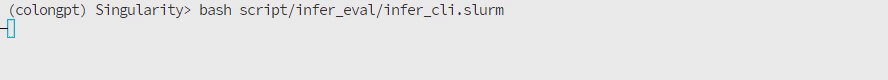
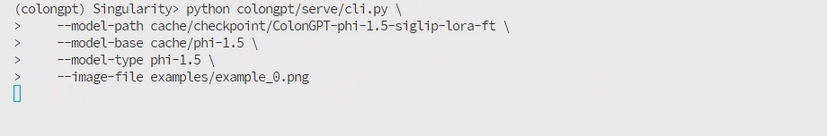
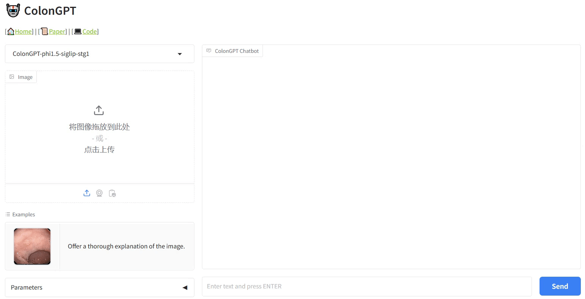
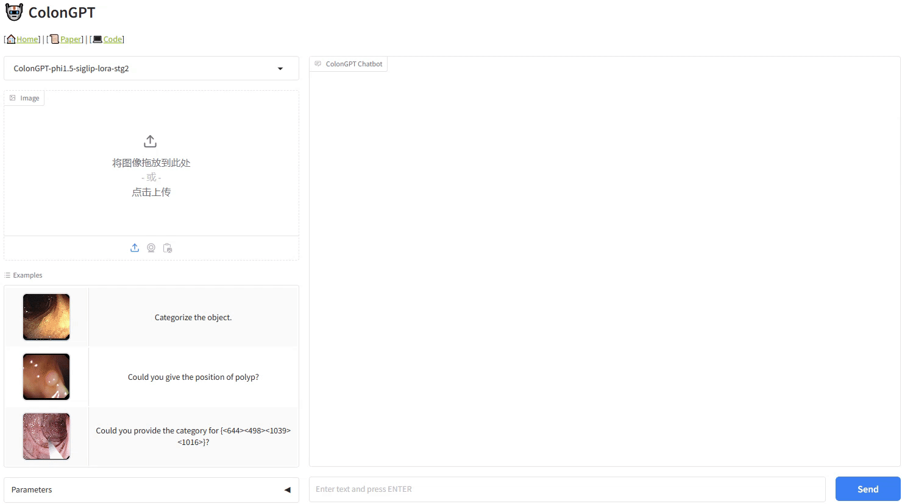

# Guidelines for ColonGPT 

<p align="center">
     <br /> 
    <em> 
    Figure 1: Details of our colonoscopy-specific multimodal language model, ColonGPT.
    </em>
</p>

🤖 We provide a complete workflow of ColonGPT for advancing multimodal intelligence in colonoscopy, covering everything from model training and inference to performance evaluation.


## Contents

- [Guidelines for ColonGPT](#guidelines-for-colongpt)
  - [Contents](#contents)
  - [😸 Quick start](#-quick-start)
  - [🏁 Installation guide](#-installation-guide)
  - [🚅 Training](#-training)
      - [1️⃣ STEP-I: Pre-alignment stage](#step-i-pre-alignment-stage)
      - [1️⃣ STEP-II: Supervised fine-tuning stage](#step-ii-supervised-fine-tuning-stage)
  - [💭 Inference instructions](#-inference-instructions)
      - [1️⃣ Batch Inference](#1️⃣-batch-inference)
      - [2️⃣ CLI Inference](#2️⃣-cli-inference)
      - [3️⃣ Gradio Web UI](#3️⃣-gradio-web-ui)
  - [💯 Multimodal benchmark](#-multimodal-benchmark)
      - [1️⃣ How to evaluate ColonGPT?](#1️⃣-how-to-evaluate-colongpt)
      - [2️⃣ Multimodal benchmark](#2️⃣-multimodal-benchmark)


## 😸 Quick start

We show a code snippet to show you how to quickly try-on our ColonGPT model with HuggingFace transformers quickly. For convenience, we manually combined some configuration and code files and merged the weights. Please note that this is a quick code, we recommend you installing ColonGPT's source code to explore more.

- Before running the snippet, you only need to install the following minimium dependencies.
    ```shell
    conda create -n quickstart python=3.10
    conda activate quickstart
    pip install torch transformers accelerate pillow
    ```
- Then you can use the command `python script/quick_start/quickstart.py` to start. Next is the quick start code:
    ```python
    import torch
    import transformers
    from transformers import AutoModelForCausalLM, AutoTokenizer, StoppingCriteria
    from PIL import Image
    import warnings

    transformers.logging.set_verbosity_error()
    transformers.logging.disable_progress_bar()
    warnings.filterwarnings('ignore')

    device = 'cuda'  # or cpu
    torch.set_default_device(device)

    model_name = "ai4colonoscopy/ColonGPT"

    model = AutoModelForCausalLM.from_pretrained(
        model_name,
        torch_dtype=torch.float16,  # or float32 for cpu
        device_map='auto',
        trust_remote_code=True
    )

    tokenizer = AutoTokenizer.from_pretrained(
        model_name,
        trust_remote_code=True
    )

    class KeywordsStoppingCriteria(StoppingCriteria):
        def __init__(self, keyword, tokenizer, input_ids):
            self.keyword_id = tokenizer(keyword).input_ids
            self.tokenizer = tokenizer
            self.start_len = input_ids.shape[1]

        def __call__(self, input_ids: torch.LongTensor, scores: torch.FloatTensor, **kwargs) -> bool:
            for keyword_id in self.keyword_id:
                if keyword_id in input_ids[0, -len(self.keyword_id):]:
                    return True
            return False

    prompt = "Categorize the object."
    text = f"USER: <image>\n{prompt} ASSISTANT:"
    text_chunks = [tokenizer(chunk).input_ids for chunk in text.split('<image>')]
    input_ids = torch.tensor(text_chunks[0] + [-200] + text_chunks[1], dtype=torch.long).unsqueeze(0).to(device)

    image = Image.open('cache/examples/example2.png')
    image_tensor = model.process_images([image], model.config).to(dtype=model.dtype, device=device)

    stop_str = "<|endoftext|>"
    stopping_criteria = KeywordsStoppingCriteria(stop_str, tokenizer, input_ids)

    output_ids = model.generate(
        input_ids,
        images=image_tensor,
        do_sample=False,
        temperature=0,
        max_new_tokens=512,
        use_cache=True,
        stopping_criteria=[stopping_criteria]
    )

    outputs = tokenizer.decode(output_ids[0, input_ids.shape[1]:]).replace("<|endoftext|>", "").strip()
    print(outputs)
    ```

<!-- (Coming soon) We advise users especially those in Chinese mainland to use ModelScope. snapshot_download can help you solve issues concerning downloading checkpoints. -->


## 🏁 Installation guide

> Note: The current code has been fully tested on Linux systems with Ampere architecture GPUs (ie, RTX4090, A100, A5000, A6000, H200). While the following steps may work on macOS and Windows, we cannot guarantee successful configuration on those platforms at this time.


- Prepare the CUDA Docker by NVIDIA. Ensure you have [Singularity container](https://docs.sylabs.io/guides/3.5/user-guide/introduction.html) installed. Alternatively, you can use [Docker container](https://www.docker.com/get-started/) with similar steps. Our suggested version way in server computers is:
    ```shell
    singularity pull docker://nvcr.io/nvidia/cuda:11.8.0-cudnn8-devel-ubuntu20.04
    ```

- Create a Conda environment within the Docker and activate it. Please modify `-B /usr/bin/git:/usr/bin/git` if needed.
    ```shell
    conda create -n colongpt python=3.10
    conda activate colongpt
    singularity run -B /usr/bin/git:/usr/bin/git --nv ./cache/cuda_11.8.0-cudnn8-devel-ubuntu20.04.sif
    ```

- Upgrade pip and install basic libraries:
    ```shell
    pip install --upgrade pip
    pip install transformers
    pip install torch torchvision xformers --index-url https://download.pytorch.org/whl/cu118
    ```

- To install [NVIDIA Apex](https://github.com/NVIDIA/apex) for optimized speed with mixed precision training, you must compile the library manually. Do not use the prebuilt Apex library in PyTorch for this setup.
    ```shell
    pip install ninja
    git clone https://github.com/NVIDIA/apex
    cd apex
    pip install -v --disable-pip-version-check --no-cache-dir --no-build-isolation --config-settings "--build-option=--cpp_ext" --config-settings "--build-option=--cuda_ext" ./
    # if you get problem with something with "" and "Killed" 
    # reference: https://github.com/NVIDIA/apex/issues/1415#issuecomment-2082867374
    MAX_JOBS=1 NVCC_APPEND_FLAGS='--threads 1' pip install -v --disable-pip-version-check --no-cache-dir --no-build-isolation --config-settings "--build-option=--cpp_ext" --config-settings "--build-option=--cuda_ext" ./
    ```

- Install [Dao-AILab/flash-attention](https://github.com/Dao-AILab/flash-attention), which provide a fast and memory-efficient exact attention for optimised training. From a [notice](https://github.com/Dao-AILab/flash-attention?tab=readme-ov-file#nvidia-cuda-support) from flash-attention, we currently only support the Ampere, Ada, or Hopper architecture GPUs (e.g., A100, RTX 3090, RTX 4090, H200). For the Turing GPUs (T4, RTX 2080) is coming soon, please use FlashAttention 1.x for Turing GPUs for now.
    ```shell
    pip install packaging
    pip install flash-attn --no-build-isolation
    ```

- Please clone our repository and install the above dependencies. If `git` cannot be used within the singularity/docker container, kindly exit the container environment and perform the operation outside.
    ```shell
    git clone git@github.com:ai4colonoscopy/IntelliScope.git
    cd IntelliScope
    pip install -e .
    ```

- Prepare the pretrained weights. Whether you're planning to train or perform inference, you'll need to download the following two pretrained weights: 
    - We currently support the siglip vision encoder, which can be accessed at 🤗 [google/siglip-so400m-patch14-384](https://huggingface.co/google/siglip-so400m-patch14-384) or 🔗 [google drive](https://drive.google.com/file/d/1tSgFw7fWZchTMSmZ53Vlz774hZn-hrSU/view?usp=sharing).
    - For the language model, we currently provide a lightweight version, 🤗 [microsoft/phi-1_5](https://huggingface.co/microsoft/phi-1_5) or 🔗 [google drive](https://drive.google.com/file/d/1GOUv6CP8bTgU_xkwOoJA8V3UtVWzcvp9/view?usp=sharing), to enable rapid proof-of-concept. More language models will be added soon, so stay tuned!

- Prepare the data, for details, please refer to 🔗 [docs/guideline-for-ColonINST.md](./guideline-for-ColonINST.md)

- Finally, please organize all files according to the following file tree.

    ```text
    ├──cache
        ├──checkpoints
            ├──ColonGPT-phi1.5-siglip-stg1
            ├──ColonGPT-phi1.5-siglip-lora-stg2
        ├──data
            ├──ColonINST
                ├──Json-file
                    ├──train
                    ├──val
                    ├──test
                ├──Positive-images
        ├──downloaded-weighs
            ├──phi-1.5
            ├──siglip-so400m-patch14-384
    ```

## 🚅 Training

Please modify the following configurations to fit your needs:

- Update `LLM_PATH` and `VISION_MODEL` to the paths of the language model and vision encoder, respectively.
- Set `DATA_PATH` and `IMAGE_FOLDER` to the paths of `ColonInst-train.json` and `ColonINST/Positive-images`, respectively.
- Set `OUTPUT_FILE` and `OUTPUT_DIR` to the name and path of trained weight, respectively.
- ColonGPT is trained on two NVIDIA H200 GPUs with an equivalent batch size of 64. In other circumstances, you can adjust the batch size and other parameters accordingly. Ensure the global batch size remains consistent: `global_batch_size=per_device_train_batch_size * gradient_accumulation_steps * num_gpus`.
- Congrats, you can now start training with `bash script/train/stage1_tuning.slurm` and `bash script/train/stage2_tuning.slurm` sequentially.:

### STEP-I: Pre-alignment stage

- Using image-caption pairs to pre-align LLM and visual encoder. Training script is as follows:

    ```bash
    #!/bin/bash
    # Please change the follow configs
    LLM_PATH=cache/downloaded-weights/phi-1.5
    VISION_MODEL=cache/downloaded-weights/siglip-so400m-patch14-384
    DATA_PATH=cache/ColonINST/Json-file/train/ColonINST-train-cap.json
    IMAGE_FOLDER=cache/ColonINST/Positive-images
    OUTPUT_FILE=ColonGPT-phi1.5-siglip-stg1
    OUTPUT_DIR=cache/checkpoint/$OUTPUT_FILE

    mkdir -p $OUTPUT_DIR

    deepspeed colongpt/train/train.py \
        --deepspeed script/deepspeed_configs/zero3.json \
        --model_name_or_path $LLM_PATH \
        --model_type phi-1.5 \
        --version colongpt \
        --data_path $DATA_PATH \
        --image_folder $IMAGE_FOLDER \
        --vision_tower $VISION_MODEL \
        --mm_projector_type ppc_14_7_1 \
        --tune_mm_mlp_adapter True \
        --image_aspect_ratio pad \
        --bf16 True \
        --output_dir $OUTPUT_DIR \
        --num_train_epochs 3 \
        --per_device_train_batch_size 16 \
        --per_device_eval_batch_size 4 \
        --gradient_accumulation_steps 2 \
        --evaluation_strategy "no" \
        --save_strategy "steps" \
        --save_steps 3000 \
        --save_total_limit 1 \
        --learning_rate 2e-4 \
        --weight_decay 0. \
        --warmup_ratio 0.03 \
        --lr_scheduler_type "cosine" \
        --logging_steps 1 \
        --tf32 True \
        --model_max_length 2048 \
        --gradient_checkpointing True \
        --dataloader_num_workers 4 \
        --lazy_preprocess True \
        --report_to none | tee 2>&1 $OUTPUT_DIR/stdout-${OUTPUT_FILE}.txt
    ```
### STEP-II: Supervised fine-tuning stage

- Adapt ColonGPT to execute three colonoscopy-specific tasks. The stage 2 tuning script is as follows:
    ```bash
    #!/bin/bash
    # Please change the follow configs
    LLM_PATH=cache/downloaded-weights/phi-1.5
    VISION_MODEL=cache/downloaded-weights/siglip-so400m-patch14-384
    DATA_PATH=cache/ColonINST/Json-file/train/ColonINST-train-3tasks.json
    IMAGE_FOLDER=cache/ColonINST/Positive-images
    OUTPUT_FILE=ColonGPT-phi1.5-siglip-lora-stg2
    OUTPUT_DIR=cache/checkpoint/$OUTPUT_FILE
    BIN=cache/checkpoint/ColonGPT-phi1.5-siglip-stg1/mm_projector.bin

    mkdir -p $OUTPUT_DIR

    deepspeed colongpt/train/train.py \
        --lora_enable True --lora_r 128 --lora_alpha 256 \
        --deepspeed script/deepspeed_configs/zero3.json \
        --model_name_or_path $LLM_PATH \
        --model_type phi-1.5 \
        --version colongpt \
        --data_path $DATA_PATH \
        --image_folder $IMAGE_FOLDER \
        --vision_tower $VISION_MODEL \
        --pretrain_mm_mlp_adapter $BIN \
        --mm_projector_type ppc_14_7_1 \
        --mm_projector_lr 2e-3 \
        --image_aspect_ratio pad \
        --group_by_modality_length False \
        --bf16 True \
        --output_dir $OUTPUT_DIR \
        --num_train_epochs 3 \
        --per_device_train_batch_size 16 \
        --per_device_eval_batch_size 4 \
        --gradient_accumulation_steps 2 \
        --evaluation_strategy "no" \
        --save_strategy "steps" \
        --save_steps 3000 \
        --save_total_limit 1 \
        --learning_rate 2e-4 \
        --weight_decay 0. \
        --warmup_ratio 0.03 \
        --lr_scheduler_type "cosine" \
        --logging_steps 1 \
        --tf32 True \
        --model_max_length 2048 \
        --gradient_checkpointing True \
        --dataloader_num_workers 4 \
        --lazy_preprocess True \
        --report_to none | tee 2>&1 $OUTPUT_DIR/stdout-${OUTPUT_FILE}.txt
    ```


## 💭 Inference instructions

We offer you guys three ways to infer ColonINST on different conversational tasks, ie, [batch inference](./guideline-for-ColonGPT.md#1%EF%B8%8F%E2%83%A3-batch-inference), [CLI inference](./guideline-for-ColonGPT.md/#1%EF%B8%8F%E2%83%A3-batch-inference), and [Gradio Web UI inference](./guideline-for-ColonGPT.md#3%EF%B8%8F%E2%83%A3-gradio-web-ui).

#### 1️⃣ Batch Inference

We provide one-key inference code. If you use ColonINST or follow the same data organization format, you only need to modify a few configurations in `script/infer_eval/infer_lora.slurm` to perform inference. 
- Set `EXP_MODEL_ID` and `LLM_PATH`to the paths of the saved weights and language model, respectively. 
- Update `IMAGE_FOLDER` and `JSON_FILE` to the paths of the `ColonINST/Positive-images` and the file to be inferred, respectively. 
- Set `INFER_MODE` to `test` for inferring the test set, or to `val` for inferring the validation set.
- Finally use `bash script/infer_eval/infer_lora.slurm` to start inference.
- The inference script is as follows:

    ```bash
    #!/bin/bash

    EXP_MODEL_ID=cache/checkpoint/ColonGPT-phi1.5-siglip-lora-stg2
    LLM_PATH=cache/downloaded-weights/phi-1.5
    IMAGE_FOLDER=cache/data/ColonINST/Positive-images
    JSON_FILE=cache/data/ColonINST/Json-file
    MODEL_TYPE=phi-1.5
    INFER_MODE=test # or val

    mkdir -p $EXP_MODEL_ID/pred

    # used for CLS task
    nohup python -m colongpt.serve.infer \
        --model_path $EXP_MODEL_ID \
        --model_base $LLM_PATH \
        --model_type $MODEL_TYPE \
        --conv_mode colongpt \
        --image_dir $IMAGE_FOLDER \
        --json_file $JSON_FILE/${INFER_MODE}/ColonINST-${INFER_MODE}-cls.json\
        --output_path $EXP_MODEL_ID/pred/${INFER_MODE}_pred_cls.json > $EXP_MODEL_ID/pred/nohup-stdout-${INFER_MODE}-pred-cls.txt 2>&1 &

    # used for REG task
    nohup python -m colongpt.serve.infer \
        --model_path $EXP_MODEL_ID \
        --model_base $LLM_PATH \
        --model_type $MODEL_TYPE \
        --conv_mode colongpt \
        --image_dir $IMAGE_FOLDER \
        --json_file $JSON_FILE/${INFER_MODE}/ColonINST-${INFER_MODE}-reg.json \
        --output_path $EXP_MODEL_ID/pred/${INFER_MODE}_pred_reg.json > $EXP_MODEL_ID/pred/nohup-stdout-${INFER_MODE}-pred-reg.txt 2>&1 &

    # used for REC task
    nohup python -m colongpt.serve.infer \
        --model_path $EXP_MODEL_ID \
        --model_base $LLM_PATH \
        --model_type $MODEL_TYPE \
        --conv_mode colongpt \
        --image_dir $IMAGE_FOLDER \
        --json_file $JSON_FILE/${INFER_MODE}/ColonINST-${INFER_MODE}-rec.json \
        --output_path $EXP_MODEL_ID/pred/${INFER_MODE}_pred_rec.json > $EXP_MODEL_ID/pred/nohup-stdout-${INFER_MODE}-pred-rec.txt 2>&1 &
    ```
- *(Optional)* Our stage-I model can be repurposed as captionb generator to generate descriptions on the given image. Use `bash script/infer_eval/infer_cap.slurm` for inference on image captioning tasks.
    ```bash
    #!/bin/bash

    EXP_MODEL_ID=cache/checkpoint/ColonGPT-phi1.5-siglip-stg1
    LLM_PATH=cache/downloaded-weights/phi-1.5
    IMAGE_FOLDER=cache/data/ColonINST/Positive-images
    JSON_FILE=cache/data/ColonINST/Json-file
    INFER_MODE=test # or val test

    mkdir -p $EXP_MODEL_ID/pred

    nohup python -m colongpt.serve.infer \
        --max_new_tokens 512 \
        --model_path $EXP_MODEL_ID \
        --model_base $LLM_PATH \
        --model_type phi-1.5 \
        --conv_mode colongpt \
        --image_dir $IMAGE_FOLDER \
        --json_file $JSON_FILE/${INFER_MODE}/ColonINST-${INFER_MODE}-cap.json \
        --output_path $EXP_MODEL_ID/pred/${INFER_MODE}_pred_cap.json > $EXP_MODEL_ID/pred/nohup-stdout-${INFER_MODE}-pred-cap.txt 2>&1 &
    ```

#### 2️⃣ CLI Inference

Chat about images using ColonGPT without the need of Gradio interface, please use the following command:

- If you use LoRA tuning, the cli inference script is as follows:
- Set `EXP_MODEL_ID` and `LLM_PATH`to the paths of the saved weights and language model, respectively. 
- Set `IMAGE_FILE` to the path of the image you want to infer.
- Run `bash script/infer_eval/infer_cli.slurm`, then enter your instruction and the result will be printed on the screen.
    ```shell
    #!/bin/bash

    EXP_MODEL_ID=cache/checkpoint/ColonGPT-phi1.5-siglip-lora-stg2
    LLM_PATH=cache/downloaded-weights/phi-1.5
    IMAGE_FILE=cache/examples/example1.png

    python colongpt/serve/cli.py \
        --model-path $EXP_MODEL_ID \
        --model-base $LLM_PATH \
        --model-type phi-1.5 \
        --image-file $IMAGE_FILE
    ```

Here are some examples of clip inference:

- Using CLI inference for image classifcation (CLS)
    

- Using CLI inference for referring expression comprehension (REC)
    

- Using CLI inference for referring expression generation (REG)
    

If you want to inference the image captioning task, run the following script:

```shell
#!/bin/bash

EXP_MODEL_ID=cache/checkpoint/ColonGPT-phi1.5-siglip-stg1
LLM_PATH=cache/downloaded-weights/phi-1.5
IMAGE_FILE=cache/examples/example1.png

python colongpt/serve/cli.py \
    --model-path $EXP_MODEL_ID \
    --model-base $LLM_PATH \
    --model-type phi-1.5 \
    --image-file $IMAGE_FILE
```




#### 3️⃣ Gradio Web UI

- First, start the controller. This service orchestrates communication between the web server and model workers.


   ```python
   python -m colongpt.serve.controller \
      --host 0.0.0.0 \
      --port 10000
   ```

- Then launching the gradio web server. To interact with the models through a web interface, start the Gradio web server.

    If you want to perform the image captioning task (CAP), use the following code:
   ```python
   python -m colongpt.serve.gradio_web_server_stg1 \
      --controller http://localhost:10000 \
      --model-list-mode reload \
      --share
   ```
    If you want to perform the classification (CLS) task, referring expression generation (REG) task, or referring expression comprehension (REC) task, use the following code:
   ```python
   python -m colongpt.serve.gradio_web_server_stg2 \
      --controller http://localhost:10000 \
      --model-list-mode reload \
      --share
   ```

- Now, you can open the web interface with the URL printed on the screen. 

- Next, launching model workers. Model workers handle the processing of model inferences. Configure each worker with the appropriate model and start it.

- Set `EXP_MODEL_ID` and `LLM_PATH`to the paths of the saved weights and language model, respectively. 

    For the CAP task, set EXP_MODEL_ID to "ColonGPT-phi1.5-siglip-stg1", 
   ```python
   EXP_MODEL_ID=cache/checkpoint/ColonGPT-phi1.5-siglip-stg1
   LLM_PATH=cache/downloaded-weights/phi-1.5

   python -m colongpt.serve.model_worker \
   --host 0.0.0.0 \
   --controller http://localhost:10000 \
   --port 40000 \
   --worker http://localhost:40000 \
   --model-path $EXP_MODEL_ID \
   --model-base $LLM_PATH \
   --model-type phi-1.5
   ```

    and for the other three tasks, set EXP_MODEL_ID to "ColonGPT-phi1.5-siglip-lora-stg2".
   ```python
   EXP_MODEL_ID=cache/checkpoint/ColonGPT-phi1.5-siglip-lora-stg2
   LLM_PATH=cache/downloaded-weights/phi-1.5

   python -m colongpt.serve.model_worker \
   --host 0.0.0.0 \
   --controller http://localhost:10000 \
   --port 40000 \
   --worker http://localhost:40000 \
   --model-path $EXP_MODEL_ID \
   --model-base $LLM_PATH \
   --model-type phi-1.5
   ```

- The launched Gradio Web UI looks like this, you can directly use the examples we provide or upload any images you need for inference.

    

- *(Optional)* WebUI for image captioning function:
    

## 💯 Multimodal benchmark

#### 1️⃣ How to evaluate ColonGPT?

We set up three basic colonoscopy tasks for quantitative comparison. For the CLS and REG tasks, we adopt the accuracy metric to assess the ratio of correctly predicted categories to the total number of predictions. For the REC task, we use the intersection over union (IoU) metric to measure the localisation precision. 

To perform the evaluation, Set `EXP_MODEL_ID` the paths of the saved weights and run `bash script/infer_eval/eval.slurm`. The evaluation results will be appended to the prediction file. In addition, if you want to evaluate the prediction results of the validation set, update `EVAL_MODE` to `val`. Evaluation script is as follows:

    ```bash
    #!/bin/bash

    EXP_MODEL_ID=cache/checkpoint/ColonGPT-phi1.5-siglip-lora-stg2
    EVAL_MODE=test

    python script/multimodal_benchmark/multimodal_evaluator.py \
        --json_file $EXP_MODEL_ID/pred/${EVAL_MODE}_pred_cls.json \
        --eval_task CLS \
        --eval_mode $EVAL_MODE
        
    python script/multimodal_benchmark/multimodal_evaluator.py \
        --json_file $EXP_MODEL_ID/pred/${EVAL_MODE}_pred_reg.json \
        --eval_task REG \
        --eval_mode $EVAL_MODE

    python script/multimodal_benchmark/multimodal_evaluator.py \
        --json_file $EXP_MODEL_ID/pred/${EVAL_MODE}_pred_rec.json \
        --eval_task REC \
        --eval_mode $EVAL_MODE
    ```


#### 2️⃣ Multimodal benchmark

We provide a benchmark for multimodal tasks in the colonoscopy domain, and refer to the Baseline section for an description of how to perform the evaluation. You can evaluate any model on your own or directly download our benchmark including their predictions and evaluation results for each competitor at the download link [Google Drive](https://drive.google.com/drive/folders/1q3awr-aT50tuhW9Z01C3LKkckfG4Bk70?usp=sharing).


- We select eight recent MLMs with different configurations as competitors, including six general-purpose models and two designed for medical purposes. Consistent with ColonGPT, all competitors are retrained on the combined training and validation dialogues of ColonINST, following their original training recipes.

    | comparison model  | Link                              | 
    |-------------------|-----------------------------------|
    | MiniGPT-V2        | [MiniGPT-V2](https://github.com/Vision-CAIR/MiniGPT-4) |
    | LLaVA-v1          | [LLaVA-v1](https://github.com/haotian-liu/LLaVA) |
    | LLaVA-v1.5        | [LLaVA-v1.5](https://github.com/haotian-liu/LLaVA) |
    | Bunny-v1.0-3B     | [Bunny-v1.0-3B](https://github.com/BAAI-DCAI/Bunny) |
    | MGM-2B            | [MGM-2B](https://github.com/dvlab-research/MGM) |
    | MobileVLM-1.7B    | [MobileVLM-1.7B](https://github.com/Meituan-AutoML/MobileVLM) |
    | LLaVA-Med-v1.0    | [LLaVA-Med-v1.0](https://github.com/microsoft/LLaVA-Med/tree/v1.0.0) |
    | LLaVA-Med-v1.5    | [LLaVA-Med-v1.5](https://github.com/microsoft/LLaVA-Med) |

- Qualitative analysis. We compare the results on the seen samples from the validation set and the unseen samples from the testing set. The symbol `↑` indicates that a higher score corresponds to better performance. 

    <p align="center">
         <br />
        <em> 
        Figure 2: Multimodal benchmark on three downstream colonoscopy tasks.
        </em>
    </p>