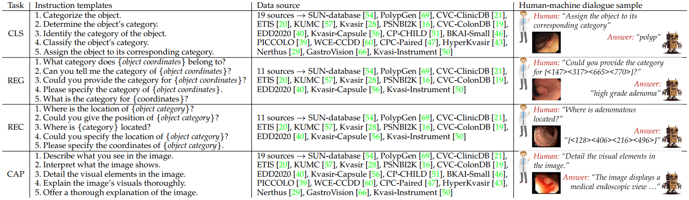

# Guidelines for ColonINST <!-- omit in toc -->

<p align="center">
     <br />
    <em> 
    Figure 1: Visualisation of the proposed ColonINST.
    </em>
</p>

## Contents

* [Overview](#overview)
* [Dataset access for ColonINST](#dataset-access-for-coloninst)
* [Dialogue organisation of ColonINST](#dialogue-organisation-of-coloninst)
* [Data statistics](#data-statistics)

## Overview

<!-- We propose a large-scale instruction tuning dataset named ColonINST. First, we begin by assembling 303,001 colonoscopy images from 19 public sub-datasets. We then design a semiautomated pipeline that draws on the expertise of GPT-4V, generating 128,620 medical captions. Lastly, we restructure 450,724 visual dialogues, instructing the model to execute four downstream tasks. 

ColonINST contains 128,620 positive images and 174,381 negative images. They are categorised into 4 root, 13 parent, and 62 child categories. In particular, the root hierarchy contains three positive categories: the pathological fndings of various colonic diseases; the anatomical structure related to the colon; and therapeutic interventions related to colonoscopy, covering pre-operative, intra-operative, and postoperative stages. 

Moreover, we establish a series of management rules for data division. For datasets with predefned divisions, we follow their original division rules. When such predefned rules are not available, we conform to widely recognised benchmarks. For the remaining datasets, we allocate their categories proportionally as 60%/10%/30% for training/validation/testing purposes. As a result, the fnal data splits for all colonoscopy images are 59.7%/8.7%/31.6% for training/validation/testing purposes. -->


We present **ColonINST**, a large-scale instruction tuning dataset designed for multimodal analysis in colonoscopy. This dataset comprises **303,001 colonoscopy images**, aggregated from 19 publicly available sub-dataset sources. Utilizing a semi-automated pipeline powered by **GPT-4V**, we have generated **128,620 detailed medical captions**, enhancing the dataset’s utility for AI model training. We finally restructured **450,724 visual dialogues** to guide the AI model through **four downstream tasks** critical for mutlimodal medical AI applications.


## Dataset access for ColonINST

The images in ColonINST were sourced from 19 public datasets, and due to strict licensing, we cannot share the datasets or download links with you directly. Therefore, first, you need to request the original images from them. Please follow the instructions for each dataset to request and download the dataset by yourself. In addition, we are only using the labeled positive part of these datasets, and you can optionally download the negative or unlabeled part of these datasets according to your needs.

- **Requesting access to image sources.** Below are the official links to request access to the 19 public datasets. And the statistics of source images are here:

    | Dataset            | Request Link                                               | Positive images (train) | Positive images (val) | Positive images (test) | Negative images (train) | Negative images (val) | Negative images (test) | Total  |
    | ------------------ | ------------------ | ------------------ | ------------------ | ------------------ | ------------------ | ------------------ | ------------------ | ------------------ |
    | SUN-database                | 🔗 [URL](http://amed8k.sundatabase.org/) |19,544                  | -                     | 29,592                 | 66,058                  | 11,009                | 33,029                 | 159,232 |
    | ETIS-Larib               | 🔗 [URL](https://polyp.grand-challenge.org/ETISLarib/) | -                       | -                     | 196                    | -                       | -                     | -                      | 196    |
    | KUMC               | 🔗 [URL](https://cvlab.eti.pg.gda.pl/en/publications/endoscopy-dataset) | 28,773                  | 4,254                 | 4,872                  | -                       | -                     | -                      | 37,899 |
    | WCE-CCDD           | 🔗 [URL](https://www.kaggle.com/datasets/francismon/curated-colon-dataset-for-deep-learning) | 1,600                   | 1,000                 | 400                    | 1,600                   | 1,000                 | 400                    | 6,000  |
    | CPC-Paired         | 🔗 [URL](https://www.tmp.link/?tmpui_page=/file&ukey=603f21d6ad407) | 104                     | 17                    | 44                     | -                       | -                     | -                      | 165    |
    | PICCOLO            | 🔗 [URL](https://www.biobancovasco.org/en/Sample-and-data-catalog/Databases/PD178-PICCOLO-EN.html) | 2,203                   | 897                   | 333                    | -                       | -                     | -                      | 3,433  |
    | Kvasir-Instrument  | 🔗 [URL](https://datasets.simula.no/kvasir-instrument/) | 472                     | -                     | 118                    | -                       | -                     | -                      | 590    |
    | Kvasir-Capsule     | 🔗 [URL](https://osf.io/dv2ag/) | 4,606                   | 767                   | 2,306                  | 23,736                  | 3,956                 | 11,867                 | 47,238 |
    | PSNBI2K            | 🔗 [URL](https://github.com/JaeZ1205/PS_NBI2k) | 1,600                   | -                     | 400                    | -                       | -                     | -                      | 2,000  |
    | HyperKvasir        | 🔗 [URL](https://datasets.simula.no/hyper-kvasir/) | 3,031                   | 507                   | 1,515                  | 997                     | 166                   | 498                    | 6,714  |
    | Kvasir             | 🔗 [URL](https://datasets.simula.no/kvasir/) | 2,100                   | 200                   | 700                    | 1,800                   | 300                   | 900                    | 6,000  |
    | EDD2020            | 🔗 [URL](https://edd2020.grand-challenge.org/) | 128                     | 21                    | 65                     | 40                      | 7                     | 19                     | 280    |
    | Nerthus            | 🔗 [URL](https://www.kaggle.com/datasets/waltervanhuissteden/the-nerthus-dataset) | 3,315                   | 552                   | 1,658                  | -                       | -                     | -                      | 5,525  |
    | CVC-ColonDB        | 🔗 [URL](http://vi.cvc.uab.es/colon-qa/cvccolondb/) | -                       | -                     | 380                    | -                       | -                     | -                      | 380    |
    | GastroVision       | 🔗 [URL](https://github.com/ic-qialanqian/WS-DefSegNet) | 2,024                   | 338                   | 1,014                  | 2,774                   | 462                   | 1,388                  | 8,000  |
    | PolypGen           | 🔗 [URL](https://lnkd.in/gtbfgm2f) | 2,257                   | 376                   | 1,129                  | 2,565                   | 428                   | 1,282                  | 8,037  |
    | CVC-ClinicDB       | 🔗 [URL](https://polyp.grand-challenge.org/CVCClinicDB/) | 550                     | -                     | 62                     | -                       | -                     | -                      | 612    |
    | CP-CHILD           | 🔗 [URL](https://figshare.com/articles/dataset/CP-CHILD_zip/12554042) | 1,100                   | -                     | 300                    | 7,000                   | -                     | 1,100                  | 9,500  |
    | BKAI-Small         | 🔗 [URL](https://www.kaggle.com/c/bkai-igh-neopolyp/) | 1,000                   | -                     | 200                    | -                       | -                     | -                      | 1,200  |
    | **Total**           | -      | 74,407                  | 8,929                 | 45,284                 | 106,570                 | 17,328                | 50,483                 | 303,001 |


- **Accessing instruction pairs of ColonINST.** Once you have successfully requested and downloaded the original images, you can download the instruction file from the 🔗 [huggingface)](https://huggingface.co/datasets/ai4colonoscopy/ColonINST-v1) or [Google drive](https://drive.google.com/drive/folders/19K18llQWCKBHi4e0txcIjKIAKouR7_ah?usp=sharing).

- **Reorganizing Dataset Files for ColonINST** After downloading the above files, you will notice a different file structure compared to our ColonINST. To reconcile these differences, you need to re-organize the files to match the structure required for ColonINST. 
1. First put the `train/val/test` files downloaded from `ai4colonoscopy/ColonINST-v1` into `cache/data/ColonINST/Json-file`, and then put all the downloaded datasets into `cache/data/ori_dataset_download`.
2. Next, combine the files in the original dataset into a structure suitable for ColonINST, as shown below. This step can be achieved by running 👨‍💻 `bash script/prepare_data/data_reorganize.slurm`.

    ```text
    ├──cache
        ├──ColonINST
            ├──Json-file
                ├──train
                    ├──ColonINST-train.json
                ├──val
                    ├──ColonINST-val-cls.json
                    |...
                ├──test
                    ├──ColonINST-test-cls.json
                    |...

            ├──Positive-images
                ├──CPC-Paired
                    ├──Train
                        ├──polyp
                            |──image_name.jpg
                            |...
                    ├──Val
                        ├──polyp
                            |──image_name.jpg
                            |...
                    ├──Test
                        ├──polyp
                            |──image_name.jpg
                            |...
                |...
    ```

## Dialogue organisation of ColonINST

Our tuning pairs primarily originate from pre-annotated 128,620 positive images, which are transformed into human-machine conversations. To enhance dialogue diversity, we set up **five different question templates** per task, in which we randomly select one to form a human-machine instruction pair. We finally reorganise a total of **450,724 human-machine dialogues**. These dialogues are specifically designed to fine-tune colonoscopy-specific multimodal language models. In figure 2, we illustrate the question templates for each task, demonstrating how we structure the prompts to guide model training.

<p align="center">
     <br />
    <em> 
    Figure 2: Instruction tuning pairs.
    </em>
</p>


- The instructions for all tasks use a json file in the same format, as follows:

    ```json
    {
        "id": "relative/path/to/an/image",
        "image": "image_name",
        "conversations": [
            {
                "from": "human",
                "value": "<image>\nA randomly selected question from 5 templates"
            },
            {
                "from": "gpt",
                "value": "The answer"
            }
        ]
    }
    ```

- **Task-I: Image Classification (CLS).** This task asks the multimodal AI model to classify 43 positive categories, detailed in Table 1. Here is an example of instruction:
    ```JSON
    {
        "id": "CVC-ClinicDB/Train/polyp/1.png",
        "image": "1",
        "conversations": [
            {
                "from": "human",
                "value": "<image>\nClassify the object's category."
            },
            {
                "from": "gpt",
                "value": "polyp"
            }
        ]
    }
    ```
- **Task-II: Referring Expression Generation (REG).** Based on the available localisation labels, we designed two reverse tasks,one of which is referring expression generation (REG). This task requires the model to classify a specified image region, and compared with the CLS task, the REG task focuses more on the object categories of localized regions in the image. Here is an example of instruction:
    ```JSON
    {
        "id": "CVC-ClinicDB/Train/polyp/103.png",
        "image": "103",
        "conversations": [
            {
                "from": "human",
                "value": "<image>\nCan you tell me the category of {<123><95><242><195>}?"
            },
            {
                "from": "gpt",
                "value": "polyp"
            }
        ]
    }
    ```

- **Task-III: Referring Expression Comprehension (REC).** This task requires the model to localize the specified category in the image and give the coordinates in the format (x<sub>min</sub>, y<sub>min</sub>, x<sub>max</sub>, y<sub>max</sub>). Here is an example of instruction:
    ```JSON
    {
        "id": "CVC-ClinicDB/Train/polyp/11.png",
        "image": "11",
        "conversations": [
            {
                "from": "human",
                "value": "<image>\nWhere is the location of polyp?"
            },
            {
                "from": "gpt",
                "value": "{<40><12><160><216>}"
            }
        ]
    }
    ```

- **Task-IV: Image Captioning (CAP).** Finally, we introduce a captioning task that serves the medical captions generated by GPT-4V as machine responses. Here is an example of instruction:
    ```JSON
    {
        "id": "CVC-ClinicDB/Train/polyp/109.png",
        "image": "109",
        "conversations": [
            {
                "from": "human",
                "value": "<image>\nInterpret what the image shows."
            },
            {
                "from": "gpt",
                "value": "This image presents a close-up view of a polyp, observed within the gastrointestinal tract during an endoscopic procedure. The polyp is characterized by its reddish, textured surface and its pedunculated shape, with a stalk that attaches to the mucosal lining. Such polyps can vary in size and number, and while often benign, they may have the potential to develop into malignant growths if left unmonitored or untreated. It is essential for healthcare professionals to accurately identify and assess these findings to determine appropriate management, including possible biopsy or removal to prevent progression to colorectal cancer."
            }
        ]
    }
    ```


## Data statistics


<p align="center">
     <br />
    <em> 
    Figure 3: Details of our multimodal instruction tuning dataset, ColonINST.
    </em>
</p>

This figure shows: (a) Three sequential steps to create the instruction tuning dataset for multimodal research. (b) Numbers of colonoscopy images designated for training, validation, and testing purposes. (c) Data taxonomy of three-level categories. (d) A word cloud of the category distribution by name size. (e) Caption generation pipeline using the VL prompting mode of GPT-4V. (f) Numbers of human-machine dialogues created for four downstream tasks.

#### 1️⃣ Colonoscopy images

The following table shows the data statistics of colonoscopy images designated for training, validation, and testing purposes. 

|         | Positive | Negative | Total    |
|---------|----------|----------|----------|
| Train set  | 74,407   | 106,570  | 180,977  |
| Val set    | 8,929    | 17,328   | 26,257   |
| Test set   | 45,284   | 50,483   | 95,767   |
| **Total** | **128,620** | **174,381** | **303,001** |


<details>
    <summary>See the table of statistical information on positive categories.</summary>

| Root class            | Parent class | Child class    | Training       | number| Validation     | number| Test           | number | Total   |
|-----------------------|--------------|--------------- |----------------|-------|----------------|-------|----------------|--------|---------|
| pathological findings | polyp related| polyp          | KUMC           | 28773 | KUMC           | 4254  | KUMC           | 4872   | 37899   |
|                       |              |                | PICCOLO        | 2203  | PICCOLO        | 897   | PICCOLO        | 333    | 3433    |
|                       |              |                | WCE-CCDD       | 800   | WCE-CCDD       | 500   | WCE-CCDD       | 200    | 1500    |
|                       |              |                | EDD2020        | 73    | EDD2020        | 12    | EDD2020        | 37     | 122     |
|                       |              |                | GastroVision   | 492   | GastroVision   | 82    | GastroVision   | 246    | 820     |
|                       |              |                | Kvasir-Capsule | 33    | Kvasir-Capsule | 6     | Kvasir-Capsule | 16     | 55      |
|                       |              |                | PolypGen       | 2257  | PolypGen       | 376   | PolypGen       | 1129   | 3762    |
|                       |              |                | Kvasir         | 900   |                |       | Kvasir         | 100    | 1000    |
|                       |              |                | BKAI-Small     | 1000  |                |       | BKAI-Small     | 200    | 1200    |
|                       |              |                | CP-CHILD       | 1100  |                |       | CP-CHILD       | 300    | 1400    |
|                       |              |                | CVC-ClinicDB   | 550   |                |       | CVC-ClinicDB   | 62     | 612     |
|                       |              |                | PSNBI2K        | 1600  |                |       | PSNBI2K        | 400    | 2000    |
|                       |              |                |                |       |                |       | CVC-ColonDB    | 380    | 380     |
|                       |              |                |                |       |                |       | ETIS           | 196    | 196     |
|                       |              | adenoma        | CPC-Paired     | 68    | CPC-Paired     | 9     | CPC-Paired     | 25     | 102     |
|                       |              | hyperplastic lesion | SUN       | 658   |                |       | SUN            | 986    | 1644    |
|                       |              |                | CPC-Paired     | 36    | CPC-Paired     | 8     | CPC-Paired     | 19     | 63      |
|                       |              | high grade adenoma | SUN        | 1495  |                |       | SUN            | 2616   | 4111    |
|                       |              | high-grade dysplasia | EDD2020  | 28    | EDD2020        | 5     | EDD2020        | 14     | 47      |
|                       |              | low grade adenoma | SUN         | 15891 |                |       | SUN            | 23943  | 39834   |
|                       |              | serrated lesion | SUN           | 1174  |                |       | SUN            | 1741   | 2915    |
|                       | cancer related | adenocarcinoma | EDD2020      | 14    | EDD2020        | 2     | EDD2020        | 7      | 23      |
|                       |              | colorectal cancer | GastroVision | 82   | GastroVision   | 15    | GastroVision   | 42     | 139     |
|                       |              | invasive carcinoma | SUN        | 326   |                |       | SUN            | 306    | 632     |
|                       |              | suspicious precancerous lesion | EDD2020 | 13 | EDD2020  | 2     | EDD2020        | 7      | 22      |
|                       | ulcer related| erosion        | Kvasir-Capsule | 303   | Kvasir-Capsule | 51    | Kvasir-Capsule | 152    | 506     |
|                       |              | ulcer          | WCE-CCDD       | 800   | WCE-CCDD       | 500   | WCE-CCDD       | 200    | 1500    |
|                       |              |                | Kvasir-Capsule | 512   | Kvasir-Capsule | 85    | Kvasir-Capsule | 257    | 854     |
|                       |              |                | GastroVision   | 3     | GastroVision   | 1     | GastroVision   | 2      | 6       |
|                       |              | UC (ulcerative colitis) | Kvasir | 600  | Kvasir         | 100   | Kvasir         | 300    | 1000    |
|                       |              | UCG0-1         | Hyper-Kvasir   | 21    | Hyper-Kvasir   | 4     | Hyper-Kvasir   | 10     | 35      |
|                       |              | UCG1-2         | Hyper-Kvasir   | 7     | Hyper-Kvasir   | 1     | Hyper-Kvasir   | 3      | 11      |
|                       |              | UCG2-3         | Hyper-Kvasir   | 17    | Hyper-Kvasir   | 3     | Hyper-Kvasir   | 8      | 28      |
|                       |              | UCG1           | Hyper-Kvasir   | 121   | Hyper-Kvasir   | 20    | Hyper-Kvasir   | 60     | 201     |
|                       |              | UCG2           | Hyper-Kvasir   | 266   | Hyper-Kvasir   | 44    | Hyper-Kvasir   | 133    | 443     |
|                       |              | UCG3           | Hyper-Kvasir   | 80    | Hyper-Kvasir   | 13    | Hyper-Kvasir   | 40     | 133     |
|                       | Inflammation | inflammatory bowel disease | GastroVision | 17 | GastroVision | 3 | GastroVision  | 9      | 29      |
|                       | Bleed        | blood fresh    | Kvasir-Capsule | 268   | Kvasir-Capsule | 44    | Kvasir-Capsule | 134    | 446     |
|                       |              | blood hematin  | Kvasir-Capsule | 7     | Kvasir-Capsule | 1     | Kvasir-Capsule | 4      | 12      |
|                       |              | blood in lumen | GastroVision   | 103   | GastroVision   | 17    | GastroVision   | 51     | 171     |
|                       | Blood vessel | angiectasia    | GastroVision   | 10    | GastroVision   | 2     | GastroVision   | 5      | 17      |
|                       |              |                | Kvasir-Capsule | 520   | Kvasir-Capsule | 86    | Kvasir-Capsule | 260    | 866     |
|                       | Others       | colon diverticula | GastroVision| 17    | GastroVision   | 3     | GastroVision   | 9      | 29      |
|                       |              | erythema       | GastroVision   | 9     | GastroVision   | 2     | GastroVision   | 4      | 15      |
|                       |              |                | Kvasir-Capsule | 95    | Kvasir-Capsule | 16    | Kvasir-Capsule | 48     | 159     |
|                       |              | hemorrhoid     | Hyper-Kvasir   | 3     | Hyper-Kvasir   | 1     | Hyper-Kvasir   | 2      | 6       |
|                       |              | lymphangiectasia | Kvasir-Capsule | 355 | Kvasir-Capsule | 59    | Kvasir-Capsule | 178    | 592     |
| anatomical structures | Cecum related | cecum         | GastroVision   | 68    | GastroVision   | 11    | GastroVision   | 34     | 113     |
|                       |              |                | Hyper-Kvasir   | 605   | Hyper-Kvasir   | 101   | Hyper-Kvasir   | 303    | 1009    |
|                       |              | ileocecal valve| GastroVision   | 120   | GastroVision   | 20    | GastroVision   | 60     | 200     |
|                       |              |                | Kvasir-Capsule | 2513  | Kvasir-Capsule | 419   | Kvasir-Capsule | 1257   | 4189    |
| clinical treatment    | Preoperative | BBPS0          | Nerthus        | 300   | Nerthus        | 50    | Nerthus        | 150    | 500     |
|                       |              | BBPS1          | Nerthus        | 1620  | Nerthus        | 270   | Nerthus        | 810    | 2700    |
|                       |              | BBPS2          | Nerthus        | 585   | Nerthus        | 97    | Nerthus        | 293    | 975     |
|                       |              | BBPS3          | Nerthus        | 810   | Nerthus        | 135   | Nerthus        | 405    | 1350    |
|                       |              | BBPS0-1        | Hyper-Kvasir   | 387   | Hyper-Kvasir   | 65    | Hyper-Kvasir   | 194    | 646     |
|                       |              | BBPS2-3        | Hyper-Kvasir   | 688   | Hyper-Kvasir   | 116   | Hyper-Kvasir   | 344    | 1148    |
|                       | Intraoperative | accessory tool | GastroVision | 760   | GastroVision   | 126   | GastroVision   | 380    | 1266    |
|                       |              |                | Kvasir Instrument| 472 |                |       | Kvasir Instrument | 118 | 590     |
|                       |              | dyed lifted polyp | GastroVision | 85   | GastroVision   | 14    | GastroVision   | 42     | 141     |
|                       |              |                | Hyper-Kvasir   | 601   | Hyper-Kvasir   | 100   | Hyper-Kvasir   | 301    | 1002    
|                       |              | retroflex rectum | GastroVision | 40    | GastroVision   | 7     | GastroVision   | 20     | 67      |
|                       |              |                | Hyper-Kvasir   | 235   | Hyper-Kvasir   | 39    | Hyper-Kvasir   | 117    | 391     |
|                       | Postoperative  | dyed resection margin | GastroVision | 148 | GastroVision | 24 | GastroVision   | 74     | 246     |
|                       |              |                | Kvasir         | 600   | Kvasir         | 100   | Kvasir         | 300    | 1000    |
|                       |              | resection margin | GastroVision | 15    | GastroVision   | 2     | GastroVision   | 8      | 25      |
|                       |              | resected polyp | GastroVision   | 55    | GastroVision   | 9     | GastroVision   | 28     | 92      |

</details>

<details>
<summary>See the table of statistical information on negativate categories.</summary>

| Root class | Parent class   | Child class                | Training       | number| Validation     | number| Test           | number | Total   |
|------------|----------------|----------------------------|----------------|-------|----------------|-------|----------------|--------|---------|
| Negative   | with object    | Barrett's                  | EDD2020        | 40    | EDD2020        | 7     | EDD2020        | 19     | 66      |
|            |                |                            | GastroVision   | 57    | GastroVision   | 10    | GastroVision   | 28     | 95      |
|            |                |                            | Hyper-Kvasir   | 25    | Hyper-Kvasir   | 4     | Hyper-Kvasir   | 12     | 41      |
|            |                | duodenal bulb              | GastroVision   | 123   | GastroVision   | 20    | GastroVision   | 62     | 205     |
|            |                | pylorus                    | GastroVision   | 236   | GastroVision   | 39    | GastroVision   | 118    | 393     |
|            |                |                            | Kvasir         | 600   | Kvasir         | 100   | Kvasir         | 300    | 1000    |
|            |                |                            | Kvasir-Capsule | 918   | Kvasir-Capsule | 153   | Kvasir-Capsule | 458    | 1529    |
|            |                | small bowel-terminal ileum | GastroVision   | 508   | GastroVision   | 84    | GastroVision   | 254    | 846     |
|            |                | ileum                      | Hyper-Kvasir   | 5     | Hyper-Kvasir   | 1     | Hyper-Kvasir   | 3      | 9       |
|            |                | ampulla of Vater           | Kvasir-Capsule | 6     | Kvasir-Capsule | 1     | Kvasir-Capsule | 3      | 10      |
|            |                | esophagitis                | WCE-CCDD       | 800   | WCE-CCDD       | 500   | WCE-CCDD       | 200    | 1500    |
|            |                |                            | GastroVision   | 64    | GastroVision   | 11    | GastroVision   | 32     | 107     |
|            |                |                            | Kvasir         | 600   | Kvasir         | 100   | Kvasir         | 300    | 1000    |
|            |                | esophagus                  | GastroVision   | 84    | GastroVision   | 14    | GastroVision   | 42     | 140     |
|            |                | esophageal varix           | GastroVision   | 4     | GastroVision   | 1     | GastroVision   | 2      | 7       |
|            |                | gastric polyp              | GastroVision   | 39    | GastroVision   | 6     | GastroVision   | 20     | 65      |
|            |                | normal stomach             | GastroVision   | 581   | GastroVision   | 97    | GastroVision   | 291    | 969     |
|            |                | normal Z-line              | GastroVision   | 198   | GastroVision   | 33    | GastroVision   | 99     | 330     |
|            |                |                            | Kvasir         | 600   | Kvasir         | 100   | Kvasir         | 300    | 1000    |
|            |                | oesophagitis-a             | Hyper-Kvasir   | 242   | Hyper-Kvasir   | 40    | Hyper-Kvasir   | 121    | 403     |
|            |                | oesophagitis-b-d           | Hyper-Kvasir   | 156   | Hyper-Kvasir   | 26    | Hyper-Kvasir   | 78     | 260     |
|            |                | impacted stool             | Hyper-Kvasir   | 79    | Hyper-Kvasir   | 13    | Hyper-Kvasir   | 39     | 131     |
|            |                | retroflex stomach          | Hyper-Kvasir   | 458   | Hyper-Kvasir   | 77    | Hyper-Kvasir   | 229    | 764     |
|            |                | short segment Barrett's    | Hyper-Kvasir   | 32    | Hyper-Kvasir   | 5     | Hyper-Kvasir   | 16     | 53      |
|            |                | foreign body               | Kvasir-Capsule | 466   | Kvasir-Capsule | 78    | Kvasir-Capsule | 232    | 776     |
|            | without object | Negative                   | WCE-CCDD       | 800   | WCE-CCDD       | 500   | WCE-CCDD       | 200    | 1500    |
|            |                |                            | CP-CHILD       | 7000  |                |       | CP-CHILD       | 1100   | 8100    |
|            |                |                            | GastroVision   | 880   | GastroVision   | 147   | GastroVision   | 440    | 1467    |
|            |                |                            | PolypGen       | 2565  | PolypGen       | 428   | PolypGen       | 1282   | 4275    |
|            |                |                            | SUN            | 66058 | SUN            | 11009 | SUN            | 33029  | 110096  |
|            |                |                            | Kvasir-Capsule | 22346 | Kvasir-Capsule | 3724  | Kvasir-Capsule | 11174  | 37244   |

</details>

#### 2️⃣ Medical captions

We feed a custom prompt and a hierarchical category prior to the advanced chatbot, GPT-4V. This model can generate detailed, professional medical descriptions for colonoscopy images, enhancing diagnostic clarity and specificity. In the following sections, we will detail the image-instruction pairs used for the training, validation, and test by task purposes. 

#### 3️⃣ Instruction tuning pairs

| | CLS | REG | REC | CAP | Total |
|---|---:|---:|---:|---:|---:|
| Train | 74,407 | 54,237 | 54,237 | 74,407 | 257,288 |
| Val | 8,929 | 4,874 | 4,874 | 8,929 | 27,606 |
| Test | 45,284 | 37,631 | 37,631 | 45,284 | 165,830 |
| Total | 128,620 | 96,742 | 96,742 | 128,620 | 450,724 |

Notably, the image sources for the image captioning (CAP) and image classification (CLS) tasks are identical, while the referring expression generation (REG) and comprehension (REC) tasks share their data sources.

- **[Training set]** Image classifcation (CLS) and captioning (CAP) tasks used 17 datasets, including 74407 images and 74407 instructions. Detailed information is provided below. 

    | Dataset           | Image  | Instruction | 
    |-------------------|--------|-------------|
    | KUMC              | 28773  | 28773       |
    | PICCOLO           | 2203   | 2203        |
    | WCE-CCDD          | 1600   | 1600        |
    | Kvasir            | 2100   | 2100        |
    | BKAI-Small        | 1000   | 1000        |
    | CP-CHILD          | 1100   | 1100        |
    | CVC-ClinicDB      | 550    | 550         |
    | PSNBI2K           | 1600   | 1600        |
    | EDD2020           | 128    | 128         |
    | GastroVision      | 2024   | 2024        |
    | Kvasir-Capsule    | 4606   | 4606        |
    | PolypGen          | 2257   | 2257        |
    | CPC-Paired        | 158    | 158         |
    | SUN               | 19544  | 19544       |
    | Hyper-Kvasir      | 3031   | 3031        |
    | Nerthus           | 3315   | 3315        |
    | Kvasir-Instrument | 472    | 472         |
  
- **[Training set]** Referring expression generation (REG) & comprehension (REC) tasks used 9 datasets, include 54225 images and 54237 instructions. Detailed information is provided below.

    | Dataset           | Image  | Instruction | 
    |-------------------|--------|-------------|
    | CVC-ClinicDB      | 550    | 550         |
    | SUN               | 19544  | 19544       |
    | Kvasir-Instrument | 472    | 472         |
    | PSNBI2K           | 1600   | 1600        |
    | Kvasir            | 900    | 900         |
    | PolypGen          | 1850   | 1850        |
    | KUMC              | 27048  | 27048       |
    | Kvasir-Capsule    | 2069   | 2069        |
    | EDD2020           | 192    | 204         |

    The EDD2020 dataset has 12 additional instructions due to 12 images containing multiple classes. In addition, the number of images in the EDD2020 dataset is counted according to its CLS as well as the CAP task.

    <details>
    <summary>Please see the 12 images that account for the additional instructions</summary>

    ```
    EDD2020/Train/all-images/EDD2020_AJ0008.jpg
    EDD2020/Train/all-images/EDD2020_AJ0018.jpg
    EDD2020/Train/all-images/EDD2020_AJ0046.jpg
    EDD2020/Train/all-images/EDD2020_B0021.jpg
    EDD2020/Train/all-images/EDD2020_B0022.jpg
    EDD2020/Train/all-images/EDD2020_B0076.jpg
    EDD2020/Train/all-images/EDD2020_B0097.jpg
    EDD2020/Train/all-images/EDD2020_INAB0028.jpg
    EDD2020/Train/all-images/EDD2020_INAB0067.jpg
    EDD2020/Train/all-images/EDD2020_INAB0069.jpg
    EDD2020/Train/all-images/EDD2020_NAF0006.jpg
    EDD2020/Train/all-images/EDD2020_NAF0068.jpg
    ```
    </details>

- **[Validation set]** Image classifcation (CLS) & captioning (CAP) tasks used 11 datasets, including 8929 images and 8929 instructions. Detailed information is provided below.

    | Dataset           | Image  | Instruction | 
    |-------------------|--------|-------------|
    | KUMC              | 4254   | 4254        |
    | PICCOLO           | 897    | 897         |
    | WCE-CCDD          | 1000   | 1000        |
    | Kvasir            | 200    | 200         |
    | EDD2020           | 21     | 21          |
    | GastroVision      | 338    | 338         |
    | Kvasir-Capsule    | 767    | 767         |
    | PolypGen          | 376    | 376         |
    | CPC-Paired        | 17     | 17          |
    | Hyper-Kvasir      | 507    | 507         |
    | Nerthus           | 552    | 552         |
    

- **[Validation set]** Referring expression generation (REG) & comprehension (REC) task used 4 datasets, include 4874 images and 4874 instructions. Detailed information is provided below. 

    | Dataset           | Image  | Instruction | 
    |-------------------|--------|-------------|
    | PolypGen          | 286    | 286         |
    | KUMC              | 4214   | 4214        |
    | Kvasir-Capsule    | 342    | 342         |
    | EDD2020           | 32     | 32          |

- **[Testing set]** Image classifcation (CLS) & captioning (CAP) tasks used 19 datasets, including 45284 images and 45284 instructions. Detailed information is provided below.

    | Dataset           | Image  | Instruction | 
    |-------------------|--------|-------------|
    | KUMC              | 4872   | 4872        |
    | PICCOLO           | 333    | 333         |
    | WCE-CCDD          | 400    | 400         |
    | Kvasir            | 700    | 700         |
    | BKAI-Small        | 200    | 200         |
    | CP-CHILD          | 300    | 300         |
    | CVC-ClinicDB      | 62     | 62          |
    | PSNBI2K           | 400    | 400         |
    | GastroVision      | 1014   | 1014        |
    | Kvasir-Capsule    | 2306   | 2306        |
    | PolypGen          | 1129   | 1129        |
    | CPC-Paired        | 44     | 44          |
    | SUN               | 29592  | 29592       |
    | Hyper-Kvasir      | 1515   | 1515        |
    | Nerthus           | 1658   | 1658        |
    | Kvasir-Instrument | 118    | 118         |
    | CVC-ColonDB       | 380    | 380         |
    | ETIS              | 196    | 196         |
    | EDD2020           | 65     | 65          |

- **[Testing set]** Referring expression generation (REG) & comprehension (REC) tasks used 11 datasets, include 37621 images and 37631 instructions. Detailed information is provided below.

    | Dataset           | Image  | Instruction | 
    |-------------------|--------|-------------|
    | CVC-ClinicDB      | 62     | 62          |
    | SUN               | 29438  | 29438       |
    | Kvasir-Instrument | 118    | 118         |
    | PSNBI2K           | 400    | 400         |
    | Kvasir            | 100    | 100         |
    | PolypGen          | 921    | 921         |
    | KUMC              | 4719   | 4719        |
    | Kvasir-Capsule    | 1037   | 1037        |
    | EDD2020           | 96     | 106         |
    | CVC-ColonDB       | 380    | 380         |
    | ETIS              | 196    | 196         |


    The EDD2020 dataset has 10 additional instructions due to 10 images containing multiple classes.
    <details>
    <summary>Here are the 10 images that account for the additional instructions</summary>

    ```
    EDD2020/Test/all-images/EDD2020_AJ0021.jpg
    EDD2020/Test/all-images/EDD2020_AJ0026.jpg
    EDD2020/Test/all-images/EDD2020_B0018.jpg
    EDD2020/Test/all-images/EDD2020_B0038.jpg
    EDD2020/Test/all-images/EDD2020_B0039.jpg
    EDD2020/Test/all-images/EDD2020_B0075.jpg
    EDD2020/Test/all-images/EDD2020_INAB0068.jpg
    EDD2020/Test/all-images/EDD2020_INAB0077.jpg
    EDD2020/Test/all-images/EDD2020_NAF0062.jpg
    EDD2020/Test/all-images/EDD2020_NAF0065.jpg
    ```
    </details>

We still post-process some special cases during our data reorganisation, such as an image with multiple objects. If an image contains multiple objects of the same positive category, the bounding boxes are merged in the form of `[xmin, ymin, xmax, ymax]`. Below, the images with bbox merging are listed separately for the training, validation, and test sets.

<details>
<summary>The following 175 images in the training set have merged bounding boxes.
</summary>

```
EDD2020\Train\all-images\EDD2020_ACB0011.jpg
EDD2020\Train\all-images\EDD2020_ACB0014.jpg
EDD2020\Train\all-images\EDD2020_AJ0002.jpg
EDD2020\Train\all-images\EDD2020_B0008.jpg
EDD2020\Train\all-images\EDD2020_B0031.jpg
EDD2020\Train\all-images\EDD2020_B0042.jpg
EDD2020\Train\all-images\EDD2020_B0043.jpg
EDD2020\Train\all-images\EDD2020_B0049.jpg
EDD2020\Train\all-images\EDD2020_B0089.jpg
EDD2020\Train\all-images\EDD2020_B0091.jpg
EDD2020\Train\all-images\EDD2020_F0002.jpg
EDD2020\Train\all-images\EDD2020_F0003.jpg
EDD2020\Train\all-images\EDD2020_F0006.jpg
EDD2020\Train\all-images\EDD2020_INAB0049.jpg
EDD2020\Train\all-images\EDD2020_NAF0003.jpg
EDD2020\Train\all-images\EDD2020_NAF0004.jpg
EDD2020\Train\all-images\EDD2020_NAF0005.jpg
EDD2020\Train\all-images\EDD2020_NAF0006.jpg
EDD2020\Train\all-images\EDD2020_NAF0017.jpg
EDD2020\Train\all-images\EDD2020_NAF0027.jpg
EDD2020\Train\all-images\EDD2020_NAF0028.jpg
EDD2020\Train\all-images\EDD2020_NAF0029.jpg
EDD2020\Train\all-images\EDD2020_NAF0030.jpg
EDD2020\Train\all-images\EDD2020_NAF0055.jpg
EDD2020\Train\all-images\EDD2020_NAF0069.jpg
Kvasir-Instrument\Train\accessory_tool\ckcx9e1ei001d3b5yr8erdyxv.jpg
Kvasir-Instrument\Train\accessory_tool\ckcu9yqhb000o3b5y5o6idona.jpg
Kvasir-Instrument\Train\accessory_tool\ckcuag8sn00103b5yv4yglb5m.jpg
Kvasir-Instrument\Train\accessory_tool\ckcuaxydc00043b5y2opk3s8z.jpg
Kvasir-Instrument\Train\accessory_tool\ckcud6lkl000d3b5yflhjqie0.jpg
Kvasir-Instrument\Train\accessory_tool\ckcu9qend000d3b5y0mgn5fhw.jpg
Kvasir-Instrument\Train\accessory_tool\ckcx42mgj000j3b5yymcy0tz1.jpg
Kvasir-Instrument\Train\accessory_tool\ckcuhp8bz001i3b5yhn16syxm.jpg
Kvasir-Instrument\Train\accessory_tool\ckcvwf9w0000z3b5ygfech2q2.jpg
Kvasir-Instrument\Train\accessory_tool\ckcvwhswz00133b5y857txzri.jpg
Kvasir-Instrument\Train\accessory_tool\ckcvwr58i001e3b5yg3jnz18l.jpg
Kvasir-Instrument\Train\accessory_tool\ckcx98wyp00133b5yfoukch5a.jpg
Kvasir-Instrument\Train\accessory_tool\ckcxau25h00083b5ym8edxa11.jpg
Kvasir-Instrument\Train\accessory_tool\ckcxazl6b000j3b5ymmxvr2sq.jpg
Kvasir-Instrument\Train\accessory_tool\ckcxbc6n900183b5yt0z7njy0.jpg
Kvasir-Instrument\Train\accessory_tool\ckcxcxnoe000p3b5yw5viltsb.jpg
Kvasir-Instrument\Train\accessory_tool\ckd04ww4w000m3b5ymats4djj.jpg
Kvasir-Instrument\Train\accessory_tool\ckd49cm8y000g3b5y4tr48vpz.jpg
Kvasir-Instrument\Train\accessory_tool\ckd4b5lwo000j3b5y6cu86kdl.jpg
Kvasir-Instrument\Train\accessory_tool\ckd4h2713000x3b5y87o6u6ek.jpg
PolypGen\Train\polyp\125OLCV1_100H0003.jpg
PolypGen\Train\polyp\14_endocv2021_positive_1266.jpg
PolypGen\Train\polyp\14_endocv2021_positive_902.jpg
PolypGen\Train\polyp\155OLCV1_100H0010.jpg
PolypGen\Train\polyp\169OLCV1_100H0007.jpg
PolypGen\Train\polyp\176OLCV1_100H0255.jpg
PolypGen\Train\polyp\186OLCV1_100H0053.jpg
PolypGen\Train\polyp\1_endocv2021_positive_343.jpg
PolypGen\Train\polyp\204OLCV1_100H0006.jpg
PolypGen\Train\polyp\23_endocv2021_positive_440.jpg
PolypGen\Train\polyp\295OLCV1_100H0004.jpg
PolypGen\Train\polyp\2_endocv2021_positive_1197.jpg
PolypGen\Train\polyp\370OLCV1_100H0010.jpg
PolypGen\Train\polyp\398OLCV1_100H0004.jpg
PolypGen\Train\polyp\3_endocv2021_positive_1041.jpg
PolypGen\Train\polyp\3_endocv2021_positive_731.jpg
PolypGen\Train\polyp\3_endocv2021_positive_861.jpg
PolypGen\Train\polyp\3_endocv2021_positive_878.jpg
PolypGen\Train\polyp\459OLCV1_100H0012.jpg
PolypGen\Train\polyp\491OLCV1_100H0004.jpg
PolypGen\Train\polyp\554OLCV1_100H0004.jpg
PolypGen\Train\polyp\596OLCV1_100H0002.jpg
PolypGen\Train\polyp\742OLCV1_100H0008.jpg
PolypGen\Train\polyp\779OLCV1_100H0006.jpg
PolypGen\Train\polyp\9_endocv2021_positive_1269.jpg
PolypGen\Train\polyp\9_endocv2021_positive_538.jpg
PolypGen\Train\polyp\9_endocv2021_positive_586.jpg
PolypGen\Train\polyp\9_endocv2021_positive_864.jpg
PolypGen\Train\polyp\C3_EndoCV2021_00108.jpg
PolypGen\Train\polyp\C3_EndoCV2021_00142.jpg
PolypGen\Train\polyp\C3_EndoCV2021_00145.jpg
PolypGen\Train\polyp\C3_EndoCV2021_00158.jpg
PolypGen\Train\polyp\C3_EndoCV2021_00177.jpg
PolypGen\Train\polyp\C3_EndoCV2021_00180.jpg
PolypGen\Train\polyp\C3_EndoCV2021_00183.jpg
PolypGen\Train\polyp\C3_EndoCV2021_0020.jpg
PolypGen\Train\polyp\C3_EndoCV2021_0024.jpg
PolypGen\Train\polyp\C3_EndoCV2021_00262.jpg
PolypGen\Train\polyp\C3_EndoCV2021_00299.jpg
PolypGen\Train\polyp\C3_EndoCV2021_00337.jpg
PolypGen\Train\polyp\C3_EndoCV2021_00341.jpg
PolypGen\Train\polyp\C3_EndoCV2021_00349.jpg
PolypGen\Train\polyp\C3_EndoCV2021_00366.jpg
PolypGen\Train\polyp\C3_EndoCV2021_00367.jpg
PolypGen\Train\polyp\C3_EndoCV2021_00368.jpg
PolypGen\Train\polyp\C3_EndoCV2021_00369.jpg
PolypGen\Train\polyp\C3_EndoCV2021_00370.jpg
PolypGen\Train\polyp\C3_EndoCV2021_00374.jpg
PolypGen\Train\polyp\C3_EndoCV2021_00375.jpg
PolypGen\Train\polyp\C3_EndoCV2021_00380.jpg
PolypGen\Train\polyp\C3_EndoCV2021_00400.jpg
PolypGen\Train\polyp\C3_EndoCV2021_00434.jpg
PolypGen\Train\polyp\C3_EndoCV2021_0044.jpg
PolypGen\Train\polyp\C3_EndoCV2021_00449.jpg
PolypGen\Train\polyp\C3_EndoCV2021_00474.jpg
PolypGen\Train\polyp\C3_EndoCV2021_0048.jpg
PolypGen\Train\polyp\C3_EndoCV2021_00483.jpg
PolypGen\Train\polyp\C3_EndoCV2021_00484.jpg
PolypGen\Train\polyp\C3_EndoCV2021_00485.jpg
PolypGen\Train\polyp\C3_EndoCV2021_00487.jpg
PolypGen\Train\polyp\C3_EndoCV2021_00488.jpg
PolypGen\Train\polyp\EndoCV2021_001049.jpg
PolypGen\Train\polyp\EndoCV2021_001063.jpg
PolypGen\Train\polyp\EndoCV2021_001085.jpg
PolypGen\Train\polyp\EndoCV2021_001086.jpg
PolypGen\Train\polyp\EndoCV2021_001094.jpg
PolypGen\Train\polyp\EndoCV2021_001097.jpg
PolypGen\Train\polyp\EndoCV2021_001098.jpg
PolypGen\Train\polyp\EndoCV2021_001112.jpg
PolypGen\Train\polyp\EndoCV2021_001118.jpg
PolypGen\Train\polyp\EndoCV2021_001123.jpg
PolypGen\Train\polyp\EndoCV2021_001124.jpg
PolypGen\Train\polyp\EndoCV2021_001194.jpg
PolypGen\Train\polyp\EndoCV2021_001195.jpg
PolypGen\Train\polyp\EndoCV2021_001250.jpg
PolypGen\Train\polyp\EndoCV2021_001268.jpg
PolypGen\Train\polyp\EndoCV2021_001281.jpg
PolypGen\Train\polyp\EndoCV2021_001282.jpg
PolypGen\Train\polyp\EndoCV2021_001306.jpg
PolypGen\Train\polyp\EndoCV2021_001311.jpg
PolypGen\Train\polyp\EndoCV2021_001327.jpg
PolypGen\Train\polyp\EndoCV2021_001329.jpg
PolypGen\Train\polyp\EndoCV2021_001346.jpg
PolypGen\Train\polyp\EndoCV2021_001362.jpg
PolypGen\Train\polyp\EndoCV2021_001386.jpg
PolypGen\Train\polyp\EndoCV2021_C5_50000008.jpg
PolypGen\Train\polyp\EndoCV2021_C5_50000024.jpg
PolypGen\Train\polyp\EndoCV2021_C5_50000057.jpg
PolypGen\Train\polyp\EndoCV2021_C5_50000110.jpg
PolypGen\Train\polyp\EndoCV2021_C5_50000111.jpg
PolypGen\Train\polyp\EndoCV2021_C5_50000115.jpg
PolypGen\Train\polyp\EndoCV2021_C5_50000124.jpg
PolypGen\Train\polyp\EndoCV2021_C5_50000128.jpg
PolypGen\Train\polyp\EndoCV2021_C5_50000140.jpg
PolypGen\Train\polyp\EndoCV2021_C5_50000166.jpg
PolypGen\Train\polyp\EndoCV2021_C5_50000167.jpg
PolypGen\Train\polyp\EndoCV2021_C5_50000168.jpg
PolypGen\Train\polyp\EndoCV2021_C5_50000181.jpg
PolypGen\Train\polyp\EndoCV2021_C5_50000194.jpg
PolypGen\Train\polyp\EndoCV2021_C5_50000196.jpg
PolypGen\Train\polyp\EndoCV2021_C5_50000202.jpg
PolypGen\Train\polyp\EndoCV2021_C5_50000212.jpg
PolypGen\Train\polyp\EndoCV2021_C5_50000214.jpg
PolypGen\Train\polyp\EndoCV2021_C5_50000215.jpg
PolypGen\Train\polyp\EndoCV2021_C5_50000221.jpg
PolypGen\Train\polyp\EndoCV2021_C5_50000222.jpg
PolypGen\Train\polyp\EndoCV2021_C5_50000224.jpg
PolypGen\Train\polyp\EndoCV2021_C5_50000229.jpg
PolypGen\Train\polyp\EndoCV2021_C5_50000279.jpg
PolypGen\Train\polyp\EndoCV2021_C5_50000306.jpg
PolypGen\Train\polyp\EndoCV2021_C5_50000319.jpg
PolypGen\Train\polyp\EndoCV2021_C5_50000341.jpg
PolypGen\Train\polyp\EndoCV2021_C5_50000346.jpg
PolypGen\Train\polyp\EndoCV2021_C5_50000347.jpg
PolypGen\Train\polyp\EndoCV2021_C5_50000348.jpg
PolypGen\Train\polyp\EndoCV2021_C5_50000352.jpg
PolypGen\Train\polyp\EndoCV2021_C5_50000368.jpg
PolypGen\Train\polyp\EndoCV2021_C5_50000378.jpg
PolypGen\Train\polyp\EndoCV2021_C6_0100025.jpg
PolypGen\Train\polyp\EndoCV2021_C6_0100040.jpg
PolypGen\Train\polyp\EndoCV2021_C6_0100042.jpg
PolypGen\Train\polyp\EndoCV2021_C6_0100044.jpg
PolypGen\Train\polyp\EndoCV2021_C6_0100045.jpg
PolypGen\Train\polyp\EndoCV2021_C6_0100049.jpg
PolypGen\Train\polyp\EndoCV2021_C6_0100076.jpg
PolypGen\Train\polyp\EndoCV2021_C6_0100077.jpg
PolypGen\Train\polyp\EndoCV2021_C6_0100112.jpg
PolypGen\Train\polyp\EndoCV2021_C6_0100113.jpg
PolypGen\Train\polyp\EndoCV2021_C6_0100114.jpg
PolypGen\Train\polyp\EndoCV2021_seq5_680.jpg
```
</details>


<details>
<summary>The following 6 images in the validation set have merged bounding boxes.</summary>

```
EDD2020\Val\all-images\EDD2020_ACB0007.jpg
EDD2020\Val\all-images\EDD2020_B0006.jpg
EDD2020\Val\all-images\EDD2020_INAB0051.jpg
EDD2020\Val\all-images\EDD2020_NAF0007.jpg
EDD2020\Val\all-images\EDD2020_NAF0011.jpg
PolypGen\Val\polyp\EndoCV2021_seq12_592.jpg
```
</details>


<details>
<summary>The following 121 images in the validation set have merged bounding boxes.</summary>

```
EDD2020\Test\all-images\EDD2020_AJ0054.jpg
EDD2020\Test\all-images\EDD2020_B0028.jpg
EDD2020\Test\all-images\EDD2020_B0075.jpg
EDD2020\Test\all-images\EDD2020_F0001.jpg
EDD2020\Test\all-images\EDD2020_F0004.jpg
EDD2020\Test\all-images\EDD2020_F0005.jpg
EDD2020\Test\all-images\EDD2020_INAB0050.jpg
EDD2020\Test\all-images\EDD2020_NAF0026.jpg
EDD2020\Test\all-images\EDD2020_NAF0034.jpg
EDD2020\Test\all-images\EDD2020_NAF0062.jpg
Kvasir-Instrument\Test\accessory_tool\ckcua5ymi000x3b5ynlsqwhhs.jpg
Kvasir-Instrument\Test\accessory_tool\ckcuhhwdt00163b5yecay6tk1.jpg
Kvasir-Instrument\Test\accessory_tool\ckcx9nmko001u3b5yopeccdvo.jpg
Kvasir-Instrument\Test\accessory_tool\ckcxbba1g00173b5y4k68a2y9.jpg
Kvasir-Instrument\Test\accessory_tool\ckd0995fe00093b5yzebk675a.jpg
PolypGen\Test\polyp\EndoCV2021_seq13_144.jpg
PolypGen\Test\polyp\EndoCV2021_seq13_156.jpg
PolypGen\Test\polyp\EndoCV2021_seq13_92.jpg
PolypGen\Test\polyp\EndoCV2021_seq14_200.jpg
PolypGen\Test\polyp\EndoCV2021_seq14_212.jpg
PolypGen\Test\polyp\EndoCV2021_seq14_220.jpg
PolypGen\Test\polyp\EndoCV2021_seq14_236.jpg
PolypGen\Test\polyp\EndoCV2021_seq14_548.jpg
PolypGen\Test\polyp\EndoCV2021_seq14_568.jpg
PolypGen\Test\polyp\EndoCV2021_seq14_588.jpg
PolypGen\Test\polyp\EndoCV2021_seq14_600.jpg
PolypGen\Test\polyp\EndoCV2021_seq14_612.jpg
PolypGen\Test\polyp\EndoCV2021_seq14_624.jpg
PolypGen\Test\polyp\EndoCV2021_seq14_628.jpg
PolypGen\Test\polyp\EndoCV2021_seq14_644.jpg
PolypGen\Test\polyp\EndoCV2021_seq14_672.jpg
PolypGen\Test\polyp\EndoCV2021_seq14_720.jpg
PolypGen\Test\polyp\EndoCV2021_seq14_728.jpg
PolypGen\Test\polyp\EndoCV2021_seq14_732.jpg
PolypGen\Test\polyp\EndoCV2021_seq14_812.jpg
PolypGen\Test\polyp\EndoCV2021_seq14_824.jpg
PolypGen\Test\polyp\EndoCV2021_seq14_836.jpg
PolypGen\Test\polyp\EndoCV2021_seq14_840.jpg
PolypGen\Test\polyp\EndoCV2021_seq14_844.jpg
PolypGen\Test\polyp\EndoCV2021_seq14_860.jpg
PolypGen\Test\polyp\EndoCV2021_seq14_872.jpg
PolypGen\Test\polyp\EndoCV2021_seq14_92.jpg
PolypGen\Test\polyp\EndoCV2021_seq15_152.jpg
PolypGen\Test\polyp\EndoCV2021_seq15_156.jpg
PolypGen\Test\polyp\EndoCV2021_seq15_196.jpg
PolypGen\Test\polyp\EndoCV2021_seq15_200.jpg
PolypGen\Test\polyp\EndoCV2021_seq15_204.jpg
PolypGen\Test\polyp\EndoCV2021_seq15_208.jpg
PolypGen\Test\polyp\EndoCV2021_seq15_212.jpg
PolypGen\Test\polyp\EndoCV2021_seq15_216.jpg
PolypGen\Test\polyp\EndoCV2021_seq15_220.jpg
PolypGen\Test\polyp\EndoCV2021_seq15_228.jpg
PolypGen\Test\polyp\EndoCV2021_seq15_232.jpg
PolypGen\Test\polyp\EndoCV2021_seq15_236.jpg
PolypGen\Test\polyp\EndoCV2021_seq15_240.jpg
PolypGen\Test\polyp\EndoCV2021_seq15_244.jpg
PolypGen\Test\polyp\EndoCV2021_seq15_248.jpg
PolypGen\Test\polyp\EndoCV2021_seq15_252.jpg
PolypGen\Test\polyp\EndoCV2021_seq15_256.jpg
PolypGen\Test\polyp\EndoCV2021_seq15_260.jpg
PolypGen\Test\polyp\EndoCV2021_seq15_264.jpg
PolypGen\Test\polyp\EndoCV2021_seq15_268.jpg
PolypGen\Test\polyp\EndoCV2021_seq15_272.jpg
PolypGen\Test\polyp\EndoCV2021_seq15_276.jpg
PolypGen\Test\polyp\EndoCV2021_seq15_292.jpg
PolypGen\Test\polyp\EndoCV2021_seq15_296.jpg
PolypGen\Test\polyp\EndoCV2021_seq15_300.jpg
PolypGen\Test\polyp\EndoCV2021_seq15_304.jpg
PolypGen\Test\polyp\EndoCV2021_seq15_308.jpg
PolypGen\Test\polyp\EndoCV2021_seq15_312.jpg
PolypGen\Test\polyp\EndoCV2021_seq15_320.jpg
PolypGen\Test\polyp\EndoCV2021_seq15_324.jpg
PolypGen\Test\polyp\EndoCV2021_seq15_328.jpg
PolypGen\Test\polyp\EndoCV2021_seq15_332.jpg
PolypGen\Test\polyp\EndoCV2021_seq15_336.jpg
PolypGen\Test\polyp\EndoCV2021_seq15_340.jpg
PolypGen\Test\polyp\EndoCV2021_seq15_344.jpg
PolypGen\Test\polyp\EndoCV2021_seq15_348.jpg
PolypGen\Test\polyp\EndoCV2021_seq15_352.jpg
PolypGen\Test\polyp\EndoCV2021_seq15_356.jpg
PolypGen\Test\polyp\EndoCV2021_seq15_360.jpg
PolypGen\Test\polyp\EndoCV2021_seq15_364.jpg
PolypGen\Test\polyp\EndoCV2021_seq15_368.jpg
PolypGen\Test\polyp\EndoCV2021_seq15_372.jpg
PolypGen\Test\polyp\EndoCV2021_seq15_376.jpg
PolypGen\Test\polyp\EndoCV2021_seq15_380.jpg
PolypGen\Test\polyp\EndoCV2021_seq15_384.jpg
PolypGen\Test\polyp\EndoCV2021_seq15_388.jpg
PolypGen\Test\polyp\EndoCV2021_seq15_392.jpg
PolypGen\Test\polyp\EndoCV2021_seq15_396.jpg
PolypGen\Test\polyp\EndoCV2021_seq15_400.jpg
PolypGen\Test\polyp\EndoCV2021_seq15_404.jpg
PolypGen\Test\polyp\EndoCV2021_seq15_408.jpg
PolypGen\Test\polyp\EndoCV2021_seq15_412.jpg
PolypGen\Test\polyp\EndoCV2021_seq15_416.jpg
PolypGen\Test\polyp\EndoCV2021_seq15_420.jpg
PolypGen\Test\polyp\EndoCV2021_seq15_424.jpg
PolypGen\Test\polyp\EndoCV2021_seq15_428.jpg
PolypGen\Test\polyp\seq5_C6_600.jpg
PolypGen\Test\polyp\seq5_C6_620.jpg
PolypGen\Test\polyp\seq5_C6_640.jpg
PolypGen\Test\polyp\seq5_C6_660.jpg
PolypGen\Test\polyp\seq5_C6_680.jpg
PolypGen\Test\polyp\seq6_C6_216.jpg
PolypGen\Test\polyp\seq6_C6_228.jpg
PolypGen\Test\polyp\seq6_C6_240.jpg
PolypGen\Test\polyp\seq6_C6_252.jpg
PolypGen\Test\polyp\seq6_C6_264.jpg
PolypGen\Test\polyp\seq6_C6_276.jpg
PolypGen\Test\polyp\seq6_C6_288.jpg
PolypGen\Test\polyp\seq6_C6_300.jpg
PolypGen\Test\polyp\seq6_C6_312.jpg
PolypGen\Test\polyp\seq6_C6_324.jpg
PolypGen\Test\polyp\seq6_C6_336.jpg
PolypGen\Test\polyp\seq6_C6_348.jpg
PolypGen\Test\polyp\seq6_C6_360.jpg
PolypGen\Test\polyp\seq6_C6_372.jpg
PolypGen\Test\polyp\seq6_C6_384.jpg
PolypGen\Test\polyp\seq6_C6_396.jpg
PolypGen\Test\polyp\seq8_C6_4080.jpg
Kvasir-Capsule\Test\erosion\eb0203196e284797_2380.jpg
```
</details>
