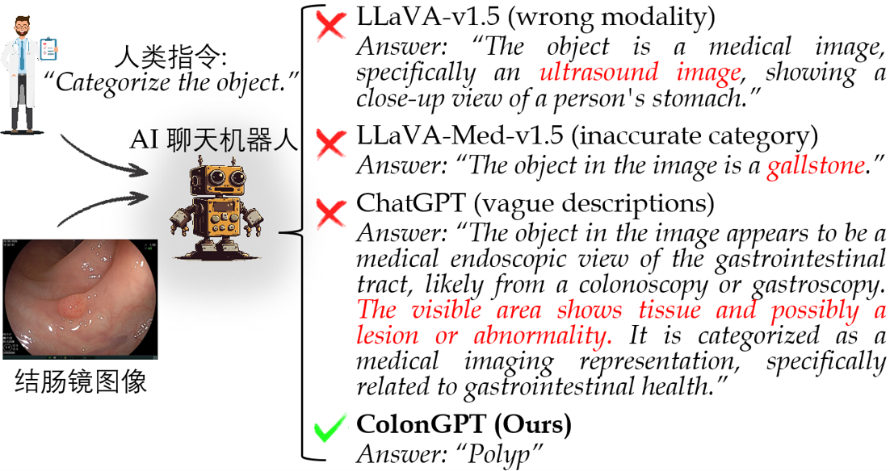

# 🚀 智驱结肠镜：多模态分析的崛起与前瞻

在多模态大模型持续突破的今天，AI正在以前所未有的速度渗透进各个领域。然而，当我们将视野投向医疗垂类场景，尤其是对诊断准确性和专业性要求较高的结肠镜检查，就会发现通用大模型仍面临**推理失真、知识脱节、指令遵循度低**等诸多问题。

与此同时，结直肠癌依然是全球第三高发和第二致死的癌症，而早筛是改善生存率的关键。**结肠镜检查**作为目前最敏感的早期筛查手段之一，承担着至关重要的角色。本文将围绕“智驱结肠镜”所展开，讨论如何让结肠镜检查过程变得更加“智慧”呢？

作者团队针对智驱结肠镜领域进行了系统化研究探讨，构建了三大核心子项目

- 📖 智驱结肠镜综述报告 ColonSurvey
- 💯 领域首个多模态指令微调数据集 ColonINST
- 🤖 面向结肠镜领域的多模态专家大模型 ColonGPT

---

### 📖 ColonSurvey：构建研究图谱

本文从**数据驱动**与**模型驱动**两大视角出发，首次系统的梳理了智能结肠镜的研究图谱，提出挑战与研究机遇，奠定了构建“智驱结肠镜”系统的基础认知框架。

- 就数据层面而言，本文对 63 个公开数据集进行全面汇总，覆盖分类、检测、分割、视觉语言任务，发现现有数据存在类别种类单一、标注粒度不够、多模态支持薄弱等问题。
  
- 就模型层面而言，本文调研了 137 个深度学习模型，梳理了其架构演进路径，并揭示了当前在网络架构创新、监督形式探索、多任务融合等方面仍有巨大空间。

      

---

### 💯 ColonINST：多模态基准

为了解决多模态结肠镜领域发展滞后的问题，本文提出 **ColonINST** —— 首个面向结肠镜场景的多模态指令微调基准，为开发结肠镜领域的视觉语言模型奠定了数据基底。

- 📚 *数据多样性与层级结构的系统整合*
   为增强社区协作性，本文从 19 个公开数据集中进行筛选、重构，系统整合出超过 30 万张图像，并引入根类别、父类别、子类别三级类别结构，覆盖从病灶到器械等62类广泛目标，形成层次化的标注体系。

   

      
    

- 💬 *多模态任务与指令驱动对话构建*
  本文还引入 GPT-4V，基于类别信息与任务目标设计提示词，自动生成专业且细粒度的图像字幕，形成医学语义丰富的描述。随后，本文将图像、字幕、标签与任务目标融合，生成 45 万条指令对话样本，支持图像分类、指称表达生成、指称表达理解以及字幕生成四项核心任务。此外，为增强模型泛化能力，本文为每项任务设计五种问题模板。

   

      
    

---

### 🤖 ColonGPT：多模态专家模型

尽管现有多模态大模型在通用场景中表现优异，但在高专业度的医疗图像任务中表现远未达标。例如，LLaVA 和 LLaVA-Med 模型均未能正确识别出结肠镜图像，而ChatGPT甚至无法准确理解人类指令。因此我们提出了 **ColonGPT** —— 面向结肠镜的视觉语言对话专家。

      

- 🧠 *设计理念*
ColonGPT 采用标准的视觉语言架构，包含文本分词器、视觉编码器、多模态适配器以及自语言模型四个模块。在多模态适配器设计上，本文引入多粒度图元池化结构，通过层次化特征整合与降维处理，将图元数量减少 66%，极大提升了模型效率与训练速度，仅需要7小时即可完成训练，方便后续版本迭代和快速改进。

       

- 🔬 *多维度基准测试*
本文将 ColonGPT 与八种主流模型（六个通用模型和两个医疗模型）进行了对比评估。对于分类任务和指称表达生成任务本文使用准确率来计算正确预测的比例。对于指称表达理解任务，本文使用 IoU 来衡量定位精度。此外本文通过验证图像中可见的解剖结构、类别名称以及临床描述的正确性来分析字幕生成任务。结果表明，ColonGPT 在所有可量化任务上均取得最佳表现，在未见样本中也展示出优越的泛化能力。

    

          
    

    

          
    

---

### 🔭 经验教训：迈向智能外科助手

本研究初步探索了结肠镜检查领域中的多模态指令微调技术，将多模态与多任务范式整合于一个因果语言模型之中。该模型特点包括在语言空间解读视觉内容，以及通过下一个词元预测处理视觉任务。尽管当前模型在感知层面取得进展，但仍面临数众多挑战，最后作者给出了一些经验教训和未来展望。

- **拥抱数据稀缺：** 扩大数据规模是提高特定领域表征能力的一种简单粗暴的方法，例如使用合成数据来弥补公共数据池不足的问题[1]，或者通过联邦学习，使多个机构在不共享原始数据的情况下协同训练。此外，通过多样化人机对话形式也可以有效地训练适用于结肠镜检查应用的人工智能专家，包括扩展问答对[2]、更多可执行的任务[3]、推理链条数据[4]等。

- **效率至上：** 未来的工作应主要围绕优化模型参数效率展开。本文通过改进多模态适配器结构在减少冗余的同时不向模型性能妥协。此外，也可以使用轻量化语言模型作为核心架构，特别在医学数据稀缺场景下有意想不到的效果。

- **改善空间感知能力：** 当前语言模型在视觉目标定位上仍存局限（如指称表达理解任务中IoU常低于50%），这可以通过在指令微调之前对多模态空间进行预训练和预对齐[5]来改善。此外让视觉部分和语言部分各司其职也是一个有前景的方案，例如采用并行框架同时生成分割掩码与语言描述[6]。

- **持续学习与适应性进化：** 为确保模型的长期有效性，其必须具备持续学习与自我调整的能力。例如通过反馈驱动的学习机制[7]实现模型的动态优化，也可以借助少样本学习[8, 9]技术促进模型在新任务上的快速适应与跨领域知识迁移的能力。

- **视觉语言导航：** 最近的视觉语言导航研究展示了将多模态数据整合到动态决策和规划任务中的潜力。例如OpenVLA[10]探索了微调视觉语言行为(VLA) 模型的有效方法，LH-VLN[11]重构了视觉语言导航任务的范式——由单个任务转向连续决策，由人工规划转向自主推理。这为未来开发智能外科助手提供了可能。

我们的长期愿景是开发一个通用智能结肠镜检查助手——一个能够理解实时影像、患者病历、生理参数等多层次医疗数据、制定自适应治疗方案，并具备自动执行手术能力的人工智能系统。它将不再只是一个工具，而是一位积极可靠的医疗合作伙伴。我们致力于通过持续努力，为多模态医疗AI的未来奠定坚实基础，推动医疗过程向智能化、普适化方向不断演进。

---

### 🔗 相关资源下载

欢迎关注我们项目的更多信息，让我们一起推动“智驱结肠镜”的未来。
- 📄 论文阅读：[英文版](https://arxiv.org/abs/2410.17241) | 中文版(即将上线)
- 💻 项目主页：[GitHub](https://github.com/ai4colonoscopy)
-   Wisemodel (国产AI平台)：[模型](https://wisemodel.cn/codes/Jingyi/IntelliScope) | [权重](https://wisemodel.cn/models/Jingyi/ColonGPT) | [数据集](https://wisemodel.cn/datasets/Jingyi/ColonINST)
- 🤗 HuggingFace：[权重](https://huggingface.co/ai4colonoscopy/ColonGPT) | [数据集](https://huggingface.co/datasets/ai4colonoscopy/ColonINST-v1)
- 📊 多模态基准：[Papers with Code](https://paperswithcode.com/dataset/coloninst-v1)

---

### 参考文献列表
[1] P. Villalobos, A. Ho, J. Sevilla, T. Besiroglu, L. Heim, and M. Hobbhahn, Position: Will we run out of data? limits of llm scaling based on human-generated data," in ICML, 2024.

[2]  B. Xiao, H. Wu, W. Xu, X. Dai, H. Hu, Y. Lu, M. Zeng, C. Liu, and L. Yuan, Florence-2: Advancing a unified representation for a variety of vision tasks," in IEEE CVPR, 2024.

[3] D. Jiang, X. He, H. Zeng, C. Wei, M. Ku, Q. Liu, and W. Chen, \Mantis: Interleaved multi-image instruction tuning," TMLR, 2024.

[4]  G. Xu, P. Jin, L. Hao, Y. Song, L. Sun, and L. Yuan, “Llava-o1: Let vision language models reason step-by-step,” arXiv, 2024.

[5] Z. Chen, J. Wu, W. Wang, W. Su, G. Chen, S. Xing, M. Zhong, Q. Zhang, X. Zhu, L. Lu et al., \Internvl: Scaling up vision foundation models and aligning for generic visuallinguistic tasks," in IEEE CVPR, 2024.

[6] X. Huang, J. Wang, Y. Tang, Z. Zhang, H. Hu, J. Lu, L. Wang, and Z. Liu, Segment and caption anything," in IEEE CVPR, 2024.

[7] T. Kaufmann, P. Weng, V. Bengs, and E. H¨ullermeier, “A survey of reinforcement learning from human feedback,” arXiv, 2024.

[8]  H. Zhang, J. Xu, S. Jiang, and Z. He, “Simple semantic-aided few-shot learning,” in Conference on computer vision and pattern recognition, 2024.

[9]  H. Xue, Y. An, Y. Qin, W. Li, Y. Wu, Y. Che, P. Fang, and M. Zhang, “Towards few-shot learning in the open world: A review and beyond,” arXiv, 2024.

[10]  M. J. Kim, K. Pertsch, S. Karamcheti, T. Xiao, A. Balakrishna, S. Nair, R. Rafailov, E. Foster, G. Lam, P. Sanketi et al., “Open-vla: An open-source vision-language-action model,” arXiv, 2024.

[11]  X. Song, W. Chen, Y. Liu, W. Chen, G. Li, and L. Lin, “Towards long-horizon vision- language navigation: Platform, benchmark and method,” in CVPR, 2025.
